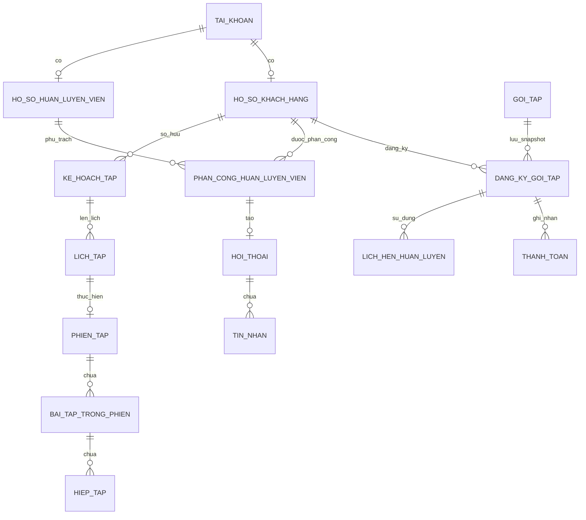

# Database — Bản nháp 28 bảng nghiệp vụ

Đã cụ thể hóa 28 bảng/52 FK thành [SQL thiết kế](../BE/database/design/schema.mysql.sql), [từ điển dữ liệu](DATABASE_DICTIONARY.md), [ERD draw.io](diagrams/database.drawio) và [28 migrations Laravel](../BE/database/migrations/README.md) theo các chính sách đã chốt. Migrations đã kiểm tra cú pháp, đối chiếu tĩnh và chạy trên Laravel/MariaDB 10.4.32; [bằng chứng](verification/MARIADB_MIGRATIONS.md). Chưa kiểm thử trên MySQL thật. Không kế thừa nguyên schema 52 bảng của Fitness hay schema du lịch/giáo dục. Ràng buộc cần service/transaction và giới hạn thiết kế được ghi ở [README database](../BE/database/design/README.md).

Catalog bài tập đã chuẩn bị từ dataset do chủ dự án cung cấp: 1.324 bài, 19 nhóm cơ chính, 28 nhãn dụng cụ và ảnh/GIF nguyên bản. Xem [ánh xạ và hướng dẫn nhập](../BE/database/data/README.md); nhóm cơ chính lấy từ `target`, không phải `muscle_group` nguồn. Tên/hướng dẫn chưa dịch toàn bộ sang tiếng Việt.

## Bảng dự kiến

| ID | Bảng | Vai trò và quan hệ chính |
| --- | --- | --- |
| T01 | `tai_khoan` | Tài khoản thống nhất, email unique, mật khẩu hash, role/trạng thái |
| T02 | `ho_so_khach_hang` | One-to-one tài khoản; mục tiêu, kinh nghiệm, thông tin cơ bản |
| T03 | `ho_so_huan_luyen_vien` | One-to-one tài khoản; chuyên môn/giới thiệu |
| T04 | `goi_tap` | Catalog do Admin cấu hình: giá VND nguyên, quyền chatbot, số lượt chatbot mỗi ngày, số buổi PT, thời hạn/trạng thái |
| T05 | `dang_ky_goi_tap` | KH–gói, snapshot giá/quyền chatbot/số buổi PT/thời hạn/hạn mức ngày; kích hoạt khi xác nhận thanh toán, gói kết hợp dùng chung thời hạn |
| T06 | `thanh_toan` | Thanh toán payOS của đăng ký; mã đơn/link/giao dịch, số tiền và kết quả đã xác minh, idempotency/đối soát |
| T07 | `phan_cong_huan_luyen_vien` | KH–PT theo khoảng hiệu lực, người phân công/lý do kết thúc |
| T08 | `khung_gio_huan_luyen_vien` | Slot PT theo ngày và khoảng thời gian; không lặp tuần phức tạp |
| T09 | `lich_hen_huan_luyen` | KH–PT–slot–phân công–đăng ký gói; trạng thái, xác nhận/tiêu hao |
| T10 | `nhom_co` | Danh mục nhóm cơ chính |
| T11 | `bai_tap` | Tên gốc/tên Việt tùy chọn, hướng dẫn đa ngôn ngữ, ảnh/GIF, nguồn/ghi công, một nhóm cơ chính, cơ phụ JSON, dụng cụ/trạng thái |
| T12 | `giao_an_mau` | Giáo án được quản lý/duyệt, mục tiêu và số ngày tập |
| T13 | `bai_tap_trong_giao_an_mau` | Mẫu–bài, chỉ số ngày/thứ tự, set/rep/nghỉ dự kiến |
| T14 | `ke_hoach_tap` | KH–PT, trạng thái, kế hoạch được thay thế, hạn duyệt 24 giờ từ lúc gửi |
| T15 | `bai_tap_trong_ke_hoach` | Nội dung snapshot bài theo ngày trong kế hoạch |
| T16 | `lich_tap` | Lịch tự tập theo kế hoạch/ngày; khác lịch hẹn PT |
| T17 | `phien_tap` | KH–lịch tập, thời điểm/trạng thái thực hiện |
| T18 | `bai_tap_trong_phien` | Nội dung bài snapshot thực hiện trong phiên |
| T19 | `hiep_tap` | Phiên-bài–số thứ tự hiệp, rep/tạ/nghỉ thực tế |
| T20 | `ghi_chu_huan_luyen` | Nhận xét PT tách khỏi kết quả phiên bất biến |
| T21 | `hoi_thoai` | Một hội thoại theo phân công; cursor đã đọc của hai phía |
| T22 | `tin_nhan` | Hội thoại/người gửi/body/client ID/timestamp/cursor |
| T23 | `hoi_thoai_tro_ly` | Hội thoại AI thuộc một KH |
| T24 | `yeu_cau_tro_ly` | Request ID, gói/ngày hạn mức/giữ lượt, provider/model/trạng thái/latency/token metadata |
| T25 | `tin_nhan_tro_ly` | Message user/assistant, nguồn/thẻ đã kiểm tra khi cần |
| T26 | `tai_lieu_tu_van` | FAQ/chính sách/lịch mẫu, trạng thái xuất bản và version |
| T27 | `chi_so_co_the` | KH, ngày ghi và cân nặng/số đo tùy phạm vi; giữ lịch sử |
| T28 | `nhat_ky_he_thong` | Actor/action/resource/timestamp; không ghi secrets/full chat |

Thông báo dùng bảng kỹ thuật `notifications` của Laravel để tránh thêm bảng riêng chỉ cho bản đầu. `sessions`, `jobs`, `failed_jobs`, `cache`, `password_reset_tokens`, `migrations` và bảng framework khác được tính riêng. `personal_access_tokens` chỉ cần nếu thực sự bật token API; cookie SPA không bắt buộc phát token.

Các khóa FK theo loại tài nguyên phải nhất quán: `khach_hang_id` trỏ profile KH, `huan_luyen_vien_id` trỏ profile PT, `tai_khoan_id/nguoi_gui_id` trỏ tài khoản. Khi viết migration phải ghi rõ, không trộn ID profile và ID account.

Gói chatbot riêng không có buổi PT; gói kết hợp có cả hai quyền lợi và dùng chung thời hạn theo ngày đủ 24 giờ. Admin đặt số lượt chatbot mỗi ngày; kích hoạt khi Backend xác nhận thanh toán payOS, mỗi khách một gói khả dụng. Không suy ra quyền từ tên gói hoặc yêu cầu PT cho gói chatbot riêng. Cần ràng buộc một gói khả dụng và liên kết request AI với gói cấp quyền/ngày hạn mức theo giờ Việt Nam: chỉ tính câu trả lời hợp lệ, lỗi không tính/retry không tính lặp, cấp lại 00:00. Hết buổi PT nhưng còn thời hạn vẫn dùng chatbot. Cột/index/cơ chế giữ lượt cần thiết kế trước migration, không mặc định tăng số bảng chỉ để lưu quota.

Đơn thanh toán giữ snapshot giá/quyền lợi và mốc hết hạn 15 phút; mã payOS/giao dịch có ràng buộc chống xử lý lặp. Không lưu checksum key/API key trong bảng nghiệp vụ. Ngoại lệ tiền đến muộn/thiếu/thừa, đơn trùng và hoàn tiền theo D01.

## Sơ đồ quan hệ rút gọn

Sơ đồ Mermaid chỉ minh họa các quan hệ chính. [Bản draw.io](diagrams/database.drawio) đã vẽ lại theo file mẫu chủ dự án: **một canvas với đủ 28 bảng, 303 cột và 52 FK**, cột PK/FK riêng, đường nối trực tiếp giữa các hàng khóa. [SVG tổng thể](diagrams/database-full.svg) và [PNG tổng thể](diagrams/database-full.png) được xuất bằng draw MCP. [Bản chi tiết 29 tab cũ](diagrams/database-chi-tiet.drawio), [ảnh nhóm module](diagrams/database-overview.png), [chi tiết bài tập](diagrams/database-exercises.png) và [chi tiết lịch PT](diagrams/database-booking.png) vẫn giữ để tham khảo. Chỉ đổi cách trình bày; SQL chưa kiểm chứng trên MySQL, không thay kiểm tra quyền/trạng thái ở Backend.

## Bổ sung runtime ảnh chat — 03/10/2026

C30/migration000035 bổ sung JSON nullable `tin_nhan.anh` cho tối đa 4 ảnh riêng tư. Tin cũ không đổi; tin chỉ có ảnh dùng nội dung rỗng. Metadata chứa đường dẫn ngẫu nhiên/MIME/tên/dung lượng/SHA-256; quyền đọc bytes theo phân công hiện tại, không công khai đường dẫn. SQL/Draw.io baseline vẫn là bản thiết kế gốc; schema runtime gồm các migrations bổ sung. Xem [hợp đồng](features/REALTIME_CHAT.md) và [từ điển](DATABASE_DICTIONARY.md#tin_nhan).

## Ràng buộc cần thiết

- Email normalized unique; role/status thuộc danh sách hợp lệ.
- Profile one-to-one unique `tai_khoan_id`; kiểm tra profile phù hợp role ở Backend.
- Phân công không overlap theo thời gian; unique record đang mở là bảo vệ bổ sung, không tự giải quyết mọi overlap lịch sử.
- Slot được giữ bởi tối đa một lịch còn giữ chỗ; schema cần chọn generated nullable key hoặc giải pháp tương đương trên MySQL. Hủy giải phóng slot nhưng không xóa lịch.
- Trùng lịch KH kiểm tra khoảng thời gian dưới khóa KH; unique slot PT không tự ngăn KH đặt hai PT khác nhau trùng giờ.
- Một buổi chỉ tiêu hao một lần; trạng thái hoàn thành và counter gói cập nhật nguyên tử. Không cần usage ledger riêng ở bản đầu nếu lịch hẹn lưu đủ record tiêu hao + snapshot.
- Buổi quá 24 giờ chưa xác nhận ghi trạng thái quá hạn và dữ liệu đóng xử lý Admin/lý do/thời điểm/audit riêng; đóng xử lý không trừ buổi hoặc biến thành hoàn thành. Record đã diễn ra chưa xử lý chặn đổi PT theo D03/D05.
- Một kế hoạch active/KH; apply bản thay thế dưới khóa KH/plan gốc. Không viết lại kế hoạch đang được phiên lịch sử tham chiếu.
- Phiên/lịch tập unique; set retry unique theo phiên-bài/số hiệp với policy upsert chỉ khi phiên chưa hoàn thành.
- Message unique `(hoi_thoai_id, nguoi_gui_id, client_message_id)`; đọc tin theo thứ tự ổn định/cursor đầy đủ, không chỉ `H:i`.
- AI request unique theo KH/client request ID; không dùng toàn bộ history từ client như nguồn đáng tin cậy.
- Snapshot quyền chatbot/số buổi PT/hạn mức ngày đã mua không đổi khi Admin sửa catalog. Hạn mức ngày được bảo vệ khi request đồng thời; câu trả lời hợp lệ tính một lượt, lỗi không tính/retry cùng request không tính lặp; cấp lại 00:00 giờ Việt Nam.
- FK không cascade xóa payment/chat/workout history; trạng thái ngừng sử dụng riêng từng domain.

## Thời gian, tiền và báo cáo

Tiền VND nguyên; DB lưu UTC, giao diện giờ Việt Nam (`Asia/Ho_Chi_Minh`), API ISO 8601 kèm timezone theo D09 đã chốt. Số ngày/lượt còn lại tính từ dữ liệu authoritative. Gói có hiệu lực từ mốc Backend xác nhận thanh toán, hết hạn sau số ngày ×24 giờ; tại mốc hết hạn không còn cấp quyền mới. Lịch PT phải kết thúc không muộn hơn hạn gói; xác nhận trong 24 giờ sau buổi đã diễn ra trong hạn được tiêu hao gói gắn lịch dù gói vừa hết hạn. Báo cáo tiền đã nhận chỉ cộng giao dịch đã xác minh thành công, không cộng đơn chờ.

Mục tiêu/cân nặng/số đo là dữ liệu theo dõi do KH cung cấp; không tự diễn giải thành chẩn đoán hoặc chỉ số phần trăm mỡ nếu không có dữ liệu/phương pháp xác định.

## Mở rộng kỹ thuật khi triển khai danh mục

Schema/Draw.io gốc vẫn là 28 bảng/303 cột/52 FK. Runtime bổ sung UUID nullable và UNIQUE cho `ma_yeu_cau_tao` tại T04 (gói) và T12 (giáo án) bằng migrations 000029/000030, không thay migration đã chạy hoặc thêm bảng nghiệp vụ. Xem [hướng dẫn migrations](../BE/database/migrations/README.md), [hợp đồng giáo án](features/GIAO_AN_MAU.md).

## Bổ sung runtime M03 ngày 02/10/2026

Migration 000031 thêm T05 url_thanh_toan và generated khach_dang_cho_id/UNIQUE uq_t05_06 để một KH chỉ có một đơn CHO_THANH_TOAN; service đóng đơn quá hạn trước tạo đơn mới. T07 thêm client_request_id nullable/UNIQUE uq_t07_02 và phan_cong_truoc_id để chống tạo lặp và đối chiếu phiên bản phân công. Không sửa SQL/Draw.io hoặc 28 migrations gốc; không thêm bảng nghiệp vụ. Khoản thu T06 dùng mã giao dịch unique và trường đối soát/hoàn tiền đã có. [Hợp đồng M03](features/MUA_GOI_THANH_TOAN.md), [kiểm chứng MariaDB](verification/M03_MUA_GOI.md).
