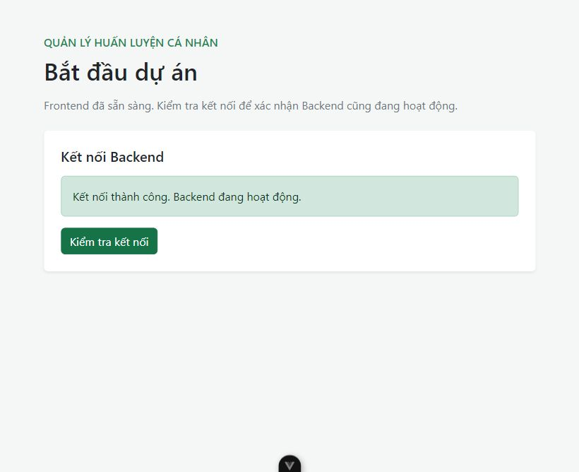

# Kiểm chứng bootstrap — 01/10/2026

Đã tạo framework ở thư mục tạm, ghép vào `BE/`/`FE/` hiện có và giữ nguyên migrations, catalog/media của chủ dự án. Dependencies tải từ Packagist/npm; không sao chép từ các dự án tham khảo. AGENTS của dự án được giữ nguyên. Hướng dẫn agent của scaffold Laravel yêu cầu thêm Boost nên không được đưa vào dự án; công cụ này nằm ngoài phạm vi khởi tạo hiện tại.

## Môi trường và phiên bản

- Windows/PowerShell; PHP 8.4.0, Composer 2.8.12, Node 22.20.0, npm 10.9.3.
- Laravel framework 13.34.0; Vue 3.5.43, Vite 8.3.1, Vue Router 5.3.1, Pinia 4.0.3, Axios 1.20.0, Bootstrap 5.3.8.
- composer.lock/package-lock.json giữ phiên bản đã cài. Đã loại npm-run-all2 của scaffold vì yêu cầu Node mới hơn môi trường; lint gọi trực tiếp công cụ đã cài. Lần install cuối không có cảnh báo engine.

## Kết quả thực sự đã chạy

| Kiểm tra | Kết quả / phạm vi |
| --- | --- |
| Composer install/dump-autoload/validate strict | Thành công, package discovery và lockfile hợp lệ |
| Frontend build | Thành công, tạo FE/dist/ |
| ESLint/Oxlint và Prettier check | Thành công |
| Laravel feature tests | 3 tests, 14 assertions: JSON health, origin frontend được CORS credentials, origin khác không được phản chiếu |
| Laravel Pint | Thành công trên các file PHP bootstrap đã sửa |
| Laravel route list | Có GET /api/v1/health |
| Kiểm tra migrations tĩnh | 28 bảng/303 cột/52 FK RESTRICT/26 UNIQUE/8 INDEX/9 CHECK/4 generated; thứ tự tạo/xóa theo FK |
| Kiểm tra dữ liệu | 1.324 bài, 19 nhóm cơ, 2.648 media đối chiếu nguyên bản; Draw.io/SQL/JSON vẫn khớp |
| Trình duyệt tích hợp | Mở Vue localhost:5173, bấm Kiểm tra kết nối, nhận Kết nối thành công từ Laravel localhost:8000 |

Frontend dùng Options API, gọi service → Axios instance tập trung. Router/Pinia đã đăng ký; trạng thái kết nối nằm trong component. Backend health không truy cập database; model auth ánh xạ tai_khoan, không tạo users hoặc demo account.

## Giới hạn và việc tiếp theo

Ở thời điểm kiểm chứng bootstrap chưa cấu hình tài khoản MySQL, chạy migrations/rollback, nhập catalog, kiểm thử tranh chấp hoặc transaction. Tests health/CORS không truy vấn DB. Có 3 migrations kỹ thuật cho session/reset password/cache/queue ngoài 28 bảng nghiệp vụ. Sau đó đã cấu hình MariaDB 10.4.32 và chạy migrations/rollback ở database riêng; xem [kiểm chứng migrations](MARIADB_MIGRATIONS.md). Chưa kiểm thử tranh chấp/transaction nghiệp vụ hoặc nhập catalog.

Chưa có đăng nhập/phân quyền hoàn chỉnh, Sanctum, Reverb/worker, payOS, chatbot hoặc màn hình nghiệp vụ. Local dùng session/cache file, queue sync, broadcast log để kiểm tra khởi động; khi làm module tương ứng phải cấu hình theo thiết kế. Không cài hoặc gọi dịch vụ AI/thanh toán, không lấy credentials từ dự án cũ.

Cách chạy: [Backend](../../BE/README.md), [Frontend](../../FE/README.md), [migrations](../../BE/database/migrations/README.md). Hai server đã được khởi động khi kiểm tra; nếu đã dừng, chạy lại lệnh trong README.
