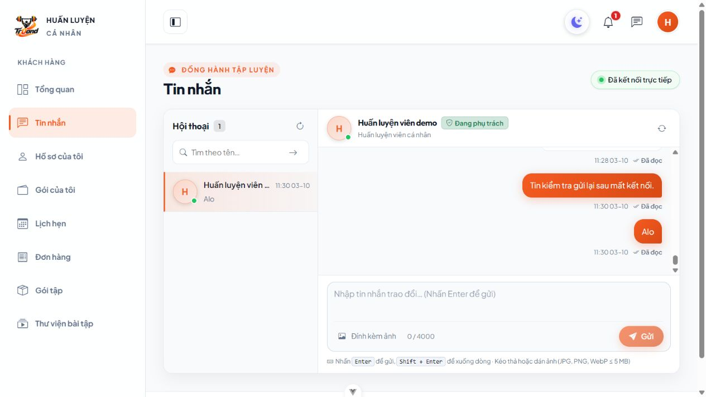
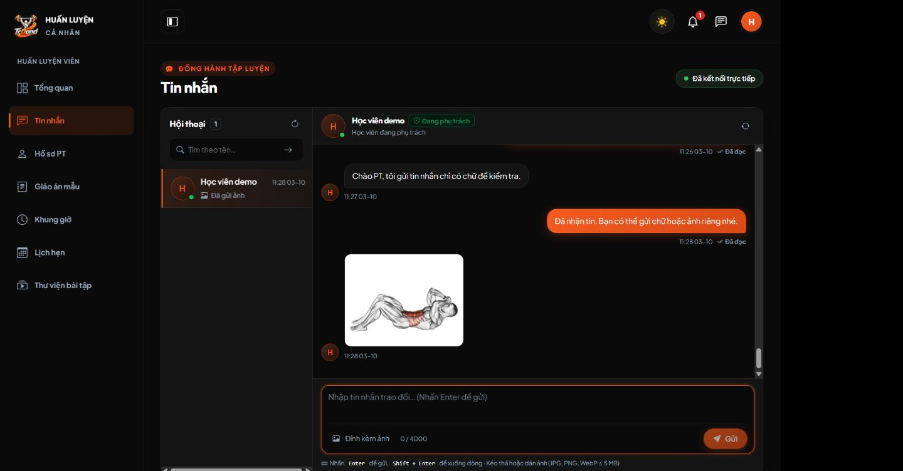
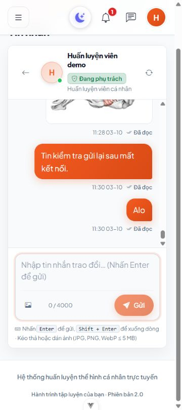

# Thu gọn chat và sửa gửi chữ — 03/10/2026

Phần kích thước toàn khung dưới đây ghi lại bản trước khi chủ dự án làm rõ muốn thu gọn **thanh soạn**, không phải cả chat. Giới hạn1.280px/680px đã bỏ; xem [thanh soạn hiện tại](CHAT_COMPOSER.md). Lỗi payload ảnh rỗng đã sửa vẫn giữ nguyên.

## Nguyên nhân và thay đổi

`TinNhan` gửi `anh: []` khi không chọn ảnh. `chatService.gui` trước đây giữ nguyên object này trong JSON, còn `ChatRequest` dùng `sometimes|array|min:1|max:4`, nên tin có chữ vẫn lỗi422 “The ảnh đính kèm field must have at least 1 items.” Các test trang trước đó mock cả chatService nên chưa kiểm tra payload HTTP.

- `FE/src/services/chatService.js`: JSON chỉ gồm UUID và nội dung; có ảnh mới gửi multipart. Không sửa object đầu vào, retry giữ UUID/chữ/tệp.
- `BE/app/Http/Requests/ChatRequest.php`: cho phép array rỗng tương đương không đính kèm, vẫn yêu cầu có chữ hoặc file hợp lệ; giữ tối đa4ảnh/5MB/MIME/kích thước và scope phân công.
- `FE/src/layouts/CaNhanLayout.vue`, `FE/src/assets/chat.css`: giới hạn riêng chat tối đa1.280px, sidebar280px (250px trên tablet desktop), chiều cao desktop460–680px. Giảm padding/khoảng cách, ảnh đơn220×170px; tin dài tối đa65ch, bong bóng tin ngắn ôm nội dung. Mobile chữ16px và nút soạn/quay lại tối thiểu44px; dashboard không bị giới hạn lại.
- Thêm regression trong `BE/tests/Feature/ChatTest.php` và `FE/tests/chatService.spec.js`; không cần migration/dependency.

## Kiểm tra đã chạy

Windows, PHP8.4/Laravel13, MariaDB10.4.32, Vue3 Options API/Vite/Vitest. Backend test tạo database riêng, không reset database ứng dụng.

| Kiểm tra | Kết quả |
| --- | --- |
| `php artisan test --filter=ChatTest` | 16 tests / 244 assertions PASS |
| `npm test` | 149 tests / 15 files PASS |
| `npm run lint:check`, `npm run build` | PASS |
| Pint ChatRequest/ChatTest | PASS |
| Prettier các FE file thay đổi | PASS |
| `git diff --check` | PASS, chỉ có thông báo CRLF/LF |
| Toàn FE `npm run format:check` | Còn warning định dạng tại `src/views/BaiTap/ChiTiet/index.vue`, ngoài phần chat; không sửa file đó trong lần này |

Regression Backend: cả KH/PT gửi chữ với `anh: []` thành công; retry đổi giữa bỏ trường ảnh và array rỗng trả cùng ID, tổng hai tin cho hai người. Blank+array rỗng hoặc ảnh không phải array bị422. ChatTest cũng chạy lại kiểm tra phân quyền, private bytes, thu hồi PT, giới hạn ảnh, transaction/rollback, hai process cùng UUID và Reverb thật. Không chạy lại toàn suite Backend trong lần sửa này.

Test service FE dùng chatService thật và mock HTTP/CSRF: tin chữ bỏ ảnh rỗng; retry giữ payload; ảnh vẫn multipart đúng thứ tự và chú thích tùy chọn.

## Trình duyệt thật

Fixture `kiem_tra_chat_ui_e8c5377ff47a3839`, FE5280/5281, Backend8011/8012, Reverb8082; tài khoản/ảnh demo, không nhắn vào dữ liệu ứng dụng.

- KH gửi chữ bằng nút Gửi; PT nhận, PT gửi chữ bằng Enter; cả hai được lưu và đọc.
- KH gửi JPEG catalog không chú thích; PT nhận ảnh. Bấm ảnh mở dialog xem lớn.
- Dừng riêng Backend QA, KH gửi chữ lỗi mạng; chạy lại Backend QA rồi Gửi lại thành công, UI chỉ hiện một tin, đã đọc.
- Desktop1920×1000: khung1.280px, sidebar280px, chiều cao680px; không tràn ngang. Desktop1440×1000 kiểm tra light KH và dark PT, menu mở/thu gọn.
- Mobile375×844: không tràn ngang, ô nhập16px; tin “Alo” bong bóng54px thay vì kéo rộng theo dòng trạng thái. Tablet768×1024 và landscape844×375 không tràn ngang, vùng đọc vẫn cuộn độc lập.
- Console PT không có warn/error. KH có lỗi mạng có chủ đích trong thử gửi lại.

QA tab/server/database/storage riêng được dọn sau kiểm tra. Người dùng tải lại trang chat để nhận CSS/JS; không cần reset hoặc chạy lại migrations. Chưa nghiệm thu MySQL8/HTTPS/WSS production trong lần sửa này.
