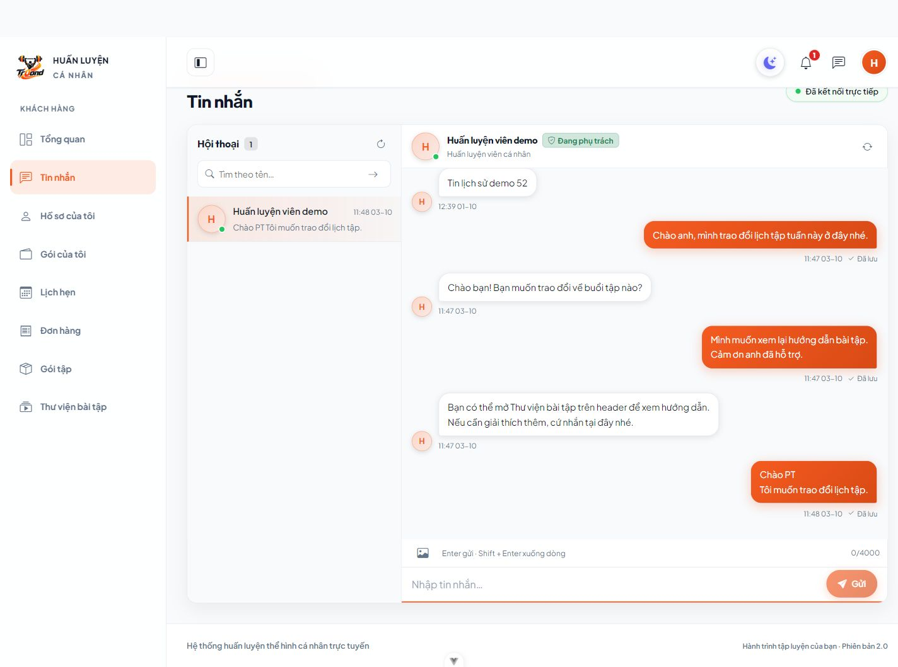
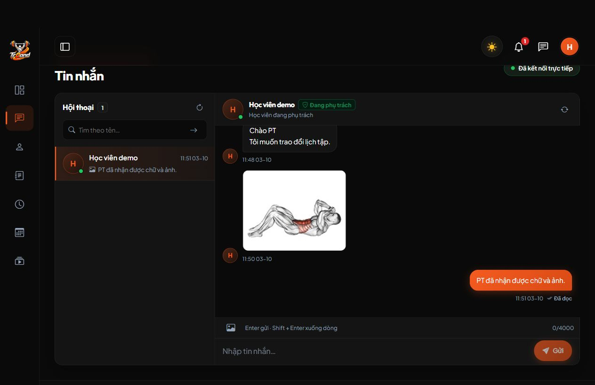
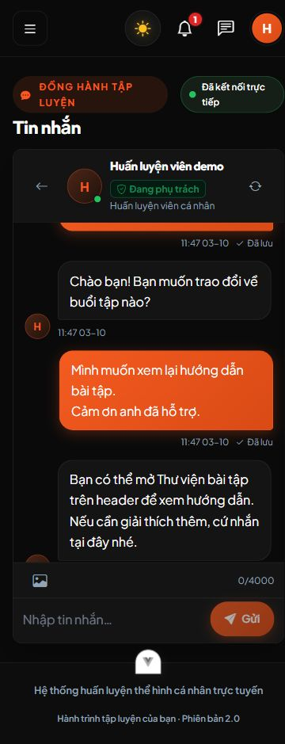

# Thanh soạn tin gọn theo mẫu Zalo — 03/10/2026

Chủ dự án làm rõ vấn đề là ô nhập quá cao, chiếm gần1/3 chat. Bản này thay bố cục thanh soạn KH/PT, trả khung chat về toàn chiều rộng bên cạnh menu và chiều cao desktop520–820px như trước lần thu gọn toàn khung. Lỗi gửi chữ/ảnh rỗng đã sửa được giữ nguyên; Backend và migrations không thay trong lần này.

## Thay đổi

- `FE/src/views/TinNhan/index.vue`: thanh ảnh/counter phía trên; textarea một dòng và Gửi cùng hàng; bỏ hộp soạn cao và footer hướng dẫn dài. Watch nội dung gọi `coGianOChat` sau DOM update để đo chiều cao, tự thu khi xóa/gửi, tối đa116px rồi cuộn. Giữ Enter gửi, Shift+Enter xuống dòng, bảo vệ IME, chọn/dán/kéo ảnh, UUID/retry và phân quyền.
- `FE/src/assets/chat.css`: thanh soạn thường khoảng102px, textarea44px, chữ16px và nút44px. Preview ảnh56×56px chỉ xuất hiện khi đính kèm, khoảng74px thêm cho hàng preview. Khung chat/sidebar trở lại kích thước trước khi thu gọn cả trang.
- `FE/src/layouts/CaNhanLayout.vue`: bỏ max-width1.280px riêng chat; dashboard vẫn toàn chiều rộng.
- Cập nhật FE README/hợp đồng chat; bản kiểm chứng trước giữ lại có ghi chú bị thay thế về kích thước.

## Kiểm thử đã chạy

Windows, Vue3 Options API/Vite/Vitest. `npm test`:149 tests/15 files PASS; `npm run lint:check`, `npm run build`:PASS. Prettier chỉ các file thay đổi PASS; `git diff --check` không có lỗi whitespace, có thông báo CRLF/LF. Không chạy lại Backend tests vì không sửa Backend trong lần này. Warning format ngoài module tại BaiTap/ChiTiet đã ghi trong bản kiểm chứng trước, không tự sửa file đó.

Trình duyệt dùng fixture riêng `kiem_tra_chat_ui_ecea18d622214dfe`, FE5280/5281, Backend8011/8012, Reverb8082 và storage QA riêng; không nhắn vào database ứng dụng.

| Tình huống | Kết quả thực tế |
| --- | --- |
| Desktop1440×1000, một dòng/không chữ | Composer101,6px, textarea44px, lịch sử588px trong khung760px |
| Shift+Enter xuống dòng | Chữ có newline, textarea68px; Enter gửi thành công, tự thu về44px |
| Dán8dòng rồi xóa | Textarea đạt116px, scrollHeight212px; xóa trở về44px |
| Ctrl+V PNG | Có preview `clipboard.png`, bỏ ảnh được; clipboard trước kiểm tra được phục hồi |
| Mobile375×844 | Composer101,6px, vùng đọc409,6px, chữ16px, không tràn ngang |
| Chữ dài mobile | Tự wrap/giãn đến116px, vùng đọc còn337,6px, không tràn ngang |
| Chọn JPEG mobile | Preview56px, composer175,6px chỉ khi đính kèm; gửi không chú thích thành công, composer trở về101,6px |
| Tablet768×1024 / landscape844×375 | Composer101,6px, không tràn ngang; landscape còn348px vùng đọc |
| KH/PT gửi/nhận | KH Enter gửi hai dòng, PT nhận chữ/ảnh; PT nút Gửi thành công, Đã đọc |
| Light/Dark | Thanh nhập hiển thị đúng; PT console không có warn/error |

Tab/server/database/storage QA đã dọn sau kiểm tra. Người dùng Ctrl+F5 trang chat để nhận giao diện, không cần migration hoặc reset dữ liệu. Đây là thay đổi thanh soạn; chưa kiểm tra production HTTPS/WSS trong lần này.
