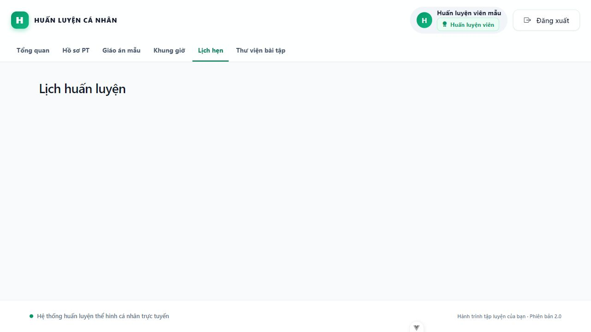
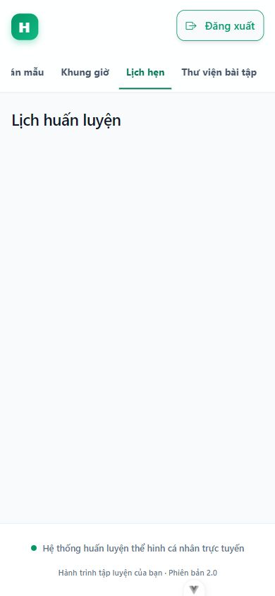
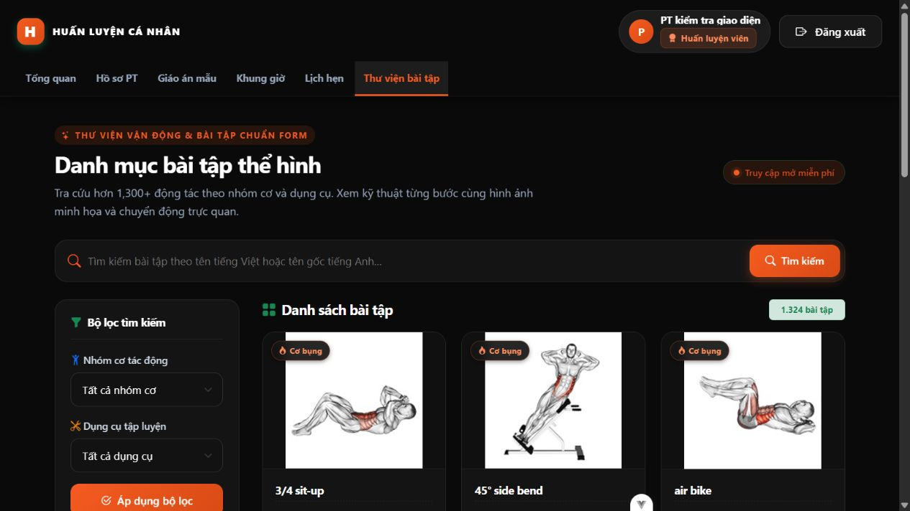

# Header PT và khởi động ngrok — 03/10/2026

- `CaNhanLayout.vue`: chuyển menu PT từ nội dung lên header chung, giữ các mục Tổng quan, Hồ sơ PT, Giáo án mẫu, Khung giờ, Lịch hẹn; đưa Thư viện bài tập từ nút riêng vào menu. Chi tiết lịch hẹn vẫn đánh dấu mục Lịch hẹn đang mở.
- `start.bat`: thêm kiểm tra ngrok trong PATH và cửa sổ `ngrok http http://localhost:8000`. Ngrok dùng cấu hình/authtoken đã lưu trên máy. Script hướng dẫn lấy URL HTTPS và thêm `/api/v1/payos/webhook`, không tự sửa kênh payOS.
- Windows, Node 22.20.0: `npm.cmd run build`, `npm.cmd run lint:check`, Prettier kiểm tra layout và 12 tests trong `tongQuan.spec.js` đều đạt. `start.bat --check` đạt, kể cả khi gọi từ thư mục ngoài dự án. Đã đối chiếu lệnh tunnel với `ngrok http --help` của bản cài trên máy; chưa khởi chạy tunnel mới hoặc kiểm thử thanh toán trong lần này.
- Kiểm tra trình duyệt bằng layout thật và tài khoản PT mẫu trong Pinia, router bộ nhớ; không gọi API, không đổi session người dùng. Ở 1280px menu nằm hàng thứ hai của header; ở 1600px nằm cùng hàng logo/tài khoản, không chồng lấn. Ở 390px chỉ menu cuộn ngang, trang không tràn ngang. Không còn menu PT trong `main`, có trạng thái đang mở trên chi tiết lịch hẹn và điều hướng bàn phím tới nút đăng xuất. File preview tạm đã xóa sau kiểm tra.

## Bổ sung: giữ header khi mở thư viện bài tập

`DanhMucLayout.vue` đã có nhánh dùng `CaNhanLayout` cho KH/Admin nhưng bỏ sót PT. Bổ sung `HUAN_LUYEN_VIEN` để danh sách/chi tiết bài tập và danh mục gói dùng cùng header theo vai trò. `CaNhanLayout.vue` đánh dấu mục Thư viện bài tập ở trang chi tiết cho KH/PT. Giữ các thay đổi giao diện tối hiện có.

Đã chạy build, lint, Prettier kiểm tra hai layout và 27 tests thuộc `baiTap.spec.js`/`tongQuan.spec.js`, đều đạt trên Windows/Node 22.20.0. Kiểm tra trình duyệt bằng hai page bài tập thật, API catalog local thật, tài khoản mẫu trong Pinia và router bộ nhớ: bấm từ menu PT vào thư viện rồi vào chi tiết vẫn có đúng một header thành viên, không có header danh mục công khai; mục thư viện giữ trạng thái đang mở. KH/Admin dùng header tương ứng, guest dùng header công khai. Kiểm tra PT tại 390px không tràn ngang toàn trang. Không đổi session hoặc ghi dữ liệu ứng dụng; preview tạm đã xóa.

