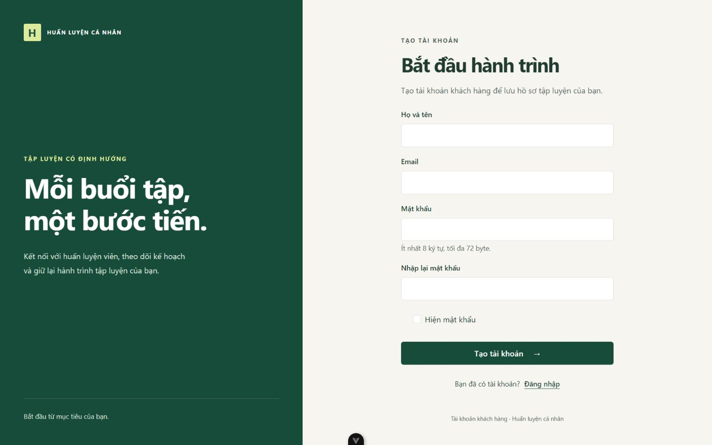
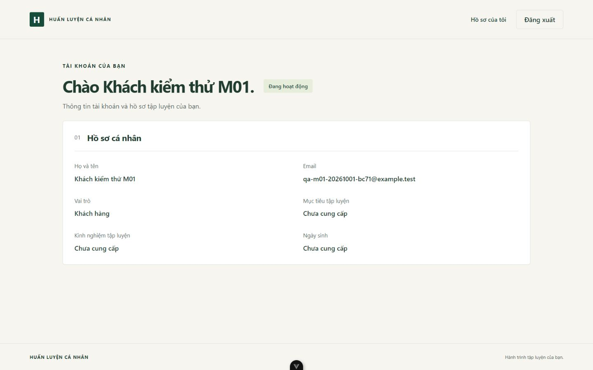
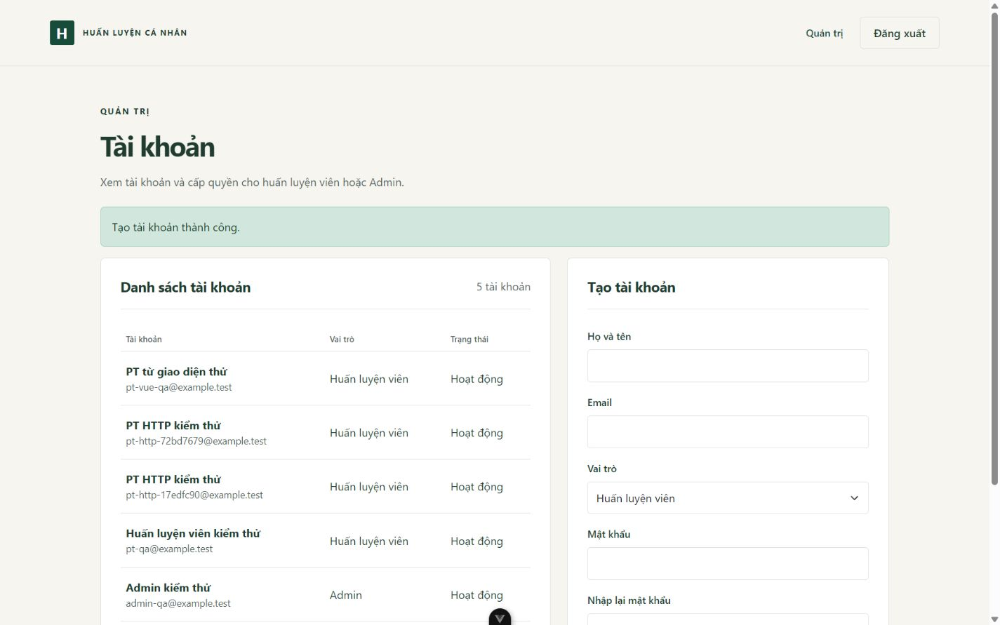
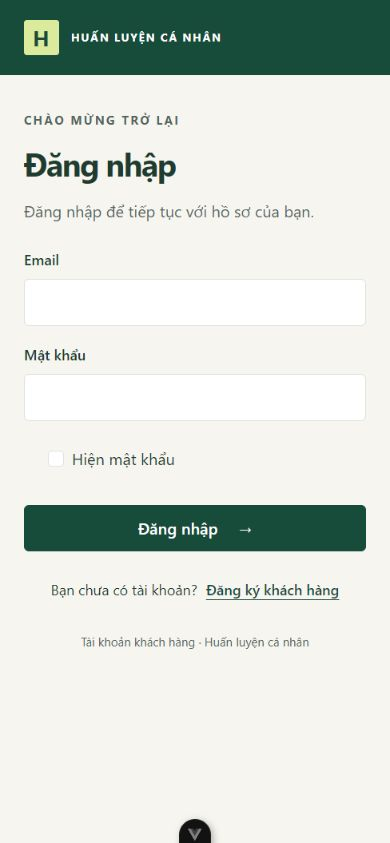
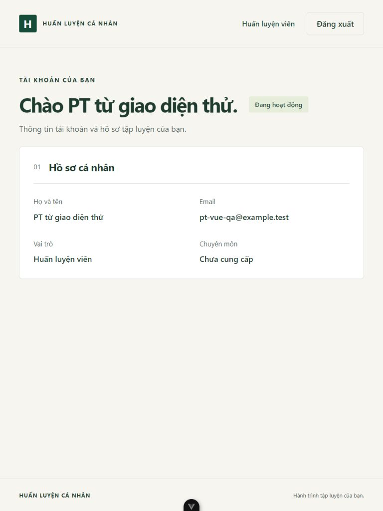
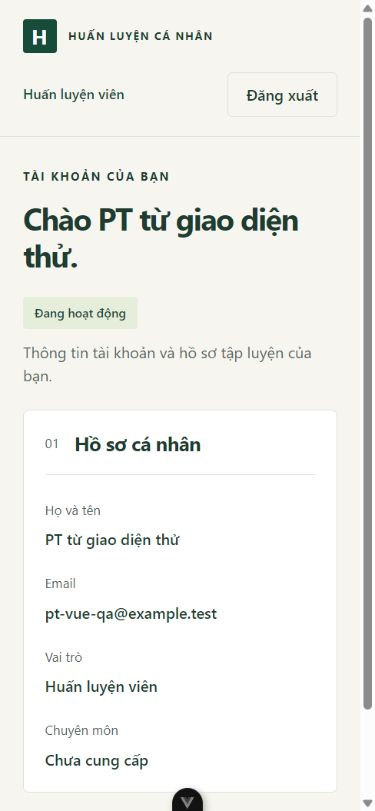

# Kiểm chứng tài khoản và phân quyền — 01/10/2026

## Phạm vi bàn giao

Đã làm luồng đăng ký khách hàng → đăng nhập → đọc hồ sơ → đăng xuất, quyền KH/PT/Admin và Admin tạo PT/Admin. Backend: Sanctum, controllers, FormRequests, models/relations, transaction service, Resource, middleware và Policy. Frontend: Options API, Pinia Options Store, Axios services, biểu mẫu có validation/loading/error, hồ sơ KH/PT, danh sách/tạo tài khoản Admin, trang sai quyền/mất kết nối.

Không thay schema/28 migrations nghiệp vụ hoặc chính sách tiền/lượt/chat. Chưa hoàn tất toàn bộ M01 trong SCOPE: quên/đặt lại mật khẩu, cập nhật hồ sơ và thao tác khóa tài khoản qua UI còn phía trước. Trạng thái khác HOAT_DONG đã bị chặn ở login và API.

## Kết quả thực tế

Môi trường Windows, PHP 8.4.0, Laravel 13.34.0, Sanctum 4.3.3, MariaDB 10.4.32; Node 22.20.0, Vue 3.5.43, Vite 8.3.1, Vitest 5.0.3.

- BE: php artisan test — **23 tests / 191 assertions PASS**. Bao gồm 3 health/CORS tests và 20 tài khoản tests.
- Kiểm tra đăng ký tạo đúng KH/hồ sơ và hash mật khẩu; không trả password/remember_token; normalize email; validation và từ chối vai trò/trạng thái/ID do client gửi.
- Kiểm tra email trùng tại validation và transaction service/UNIQUE; giả lập tạo hồ sơ thất bại để kiểm tra rollback tài khoản trên database thật.
- Đăng nhập cả ba vai trò, sai mật khẩu/email không tồn tại/tài khoản khóa, đăng xuất, chặn bearer/guest, API không có Accept vẫn trả JSON 401.
- KH đọc hồ sơ mình, không đọc hồ sơ KH khác; PT không được đọc nếu chưa có phân công, có quyền khi phân công hiện tại, mất quyền khi đóng hoặc chưa tới ngày bắt đầu.
- Chặn KH/PT ở API Admin, chặn KH ở API PT; Admin tạo PT có hồ sơ/Admin và giữ nguyên session đang thao tác; từ chối Admin tạo KH qua API cấp quyền.
- Bật lại CSRF thật trong HTTP feature tests: thiếu/sai token trên đăng ký và API Admin stateful bị 419. Rate limit login trả 429; mật khẩu Unicode quá 72 byte bị 422; command tạo Admin đầu tiên không cho tạo lần thứ hai.
- FE: **7 Vitest tests PASS**, mock service để kiểm tra khôi phục auth từ server, xóa tài khoản khi /me trả 401/403, logout thành công/session đã mất, giữ trạng thái và báo lỗi khi logout gặp 419 hoặc mất mạng. Không coi lỗi CSRF là bằng chứng server đã logout.
- FE build/lint/format PASS; Pint và Composer validate kiểm tra Backend.
- scripts/kiemTraCookieM01.php: HTTP/cURL thật tới môi trường thử, CSRF cookie → login → /me → Admin tạo PT → logout. Thiếu CSRF bị 419; cookie trước login không truy cập được tài khoản sau login; cookie sau logout không dùng lại được. Không chỉ so sánh giá trị cookie mã hóa.
- Trình duyệt: KH đăng ký thành công, refresh giữ đăng nhập, sai mật khẩu báo lỗi tiếng Việt tại ô email, trang Admin bị chặn, logout trở về login. Trong database thử riêng: Admin tạo PT qua Vue, PT vừa tạo đăng nhập và thấy đúng hồ sơ. Không có console error/warning trong các lượt kiểm tra đã đọc.
- Responsive kiểm tra 1440×900, 768×1024, 390×844; các màn hình đã xem không tràn ngang viewport. Biểu mẫu có labels/autocomplete, hiện mật khẩu, lỗi tại field, summary focus và nút bị khóa khi gửi.

## Cách kiểm tra lại

Từ BE:

```powershell
rtk proxy php artisan test
rtk proxy composer validate --strict
```

XacThucTest tự tạo database ngẫu nhiên riêng và kiểm tra tên kết nối trước khi migrate, rollback dữ liệu test bằng transaction, chỉ DROP database vừa tạo. Cần quyền CREATE/DROP DATABASE. Không dùng migrate:fresh trên database ứng dụng.

Từ FE:

```powershell
rtk proxy npm run test
rtk proxy npm run lint:check
rtk proxy npm run format:check
rtk proxy npm run build
```

Từ thư mục gốc, mở môi trường giao diện riêng:

```powershell
rtk proxy php scripts/kiemTraGiaoDienM01.php
```

Script yêu cầu cổng 8001/5174 đang trống, tạo database ngẫu nhiên, migrate và hai tài khoản giả (Admin/PT), chạy BE/FE riêng. Không seed tài khoản giả vào database ứng dụng. Ở terminal khác, chạy rtk proxy php scripts/kiemTraCookieM01.php để kiểm tra HTTP cookie/CSRF. Nhấn Enter ở terminal đầu để dừng server và DROP đúng database vừa tạo. Các mật khẩu trong script là fixture công khai chỉ dùng trong database thử tạm thời.

Ở lần kiểm tra giao diện ứng dụng chính có tạo một KH giả với email duy nhất; đã logout và dọn đúng tài khoản/hồ sơ đó. Môi trường thử riêng đã dừng và database thử đã xóa. Không tạo Admin mặc định trong ứng dụng chính.

## Ảnh giao diện













## Giới hạn

Đã kiểm chứng trên MariaDB hiện tại, chưa trên MySQL thật hoặc server HTTPS triển khai. Test email trùng kiểm tra UNIQUE/service, chưa mô phỏng hai HTTP workers đồng thời. Chưa có E2E Vue chạy tự động, mail reset password, phân công/đổi PT qua API hoặc UI khóa tài khoản. Các tests đọc phân công chỉ chuẩn bị fixture SQL để kiểm tra Policy. Không tuyên bố hoàn tất kiểm thử cạnh tranh theo PROJECT_RULES.

Áp dụng frontend-design và ui-ux-pro-max: giữ Bootstrap/Options API, tông xanh hiện có và quy tắc biểu mẫu có labels/focus/errors/responsive. Hai lượt tìm design-system trả bố cục showcase/marketing chưa phù hợp form tài khoản, nên dùng hướng dẫn biểu mẫu/accessibility chung thay thế; không lưu đề xuất marketing vào dự án.

Hướng dẫn chạy và tạo Admin thật đầu tiên tại [TAI_KHOAN.md](../features/TAI_KHOAN.md).
