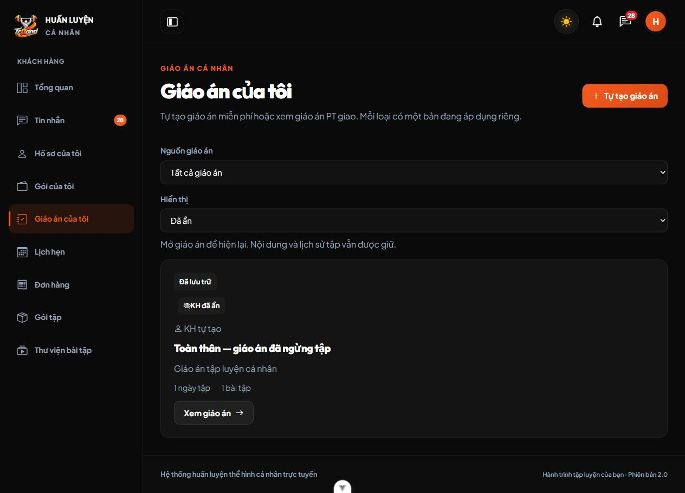
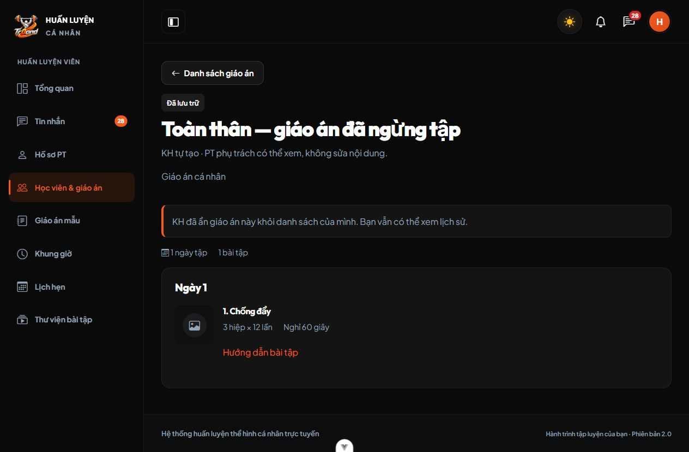
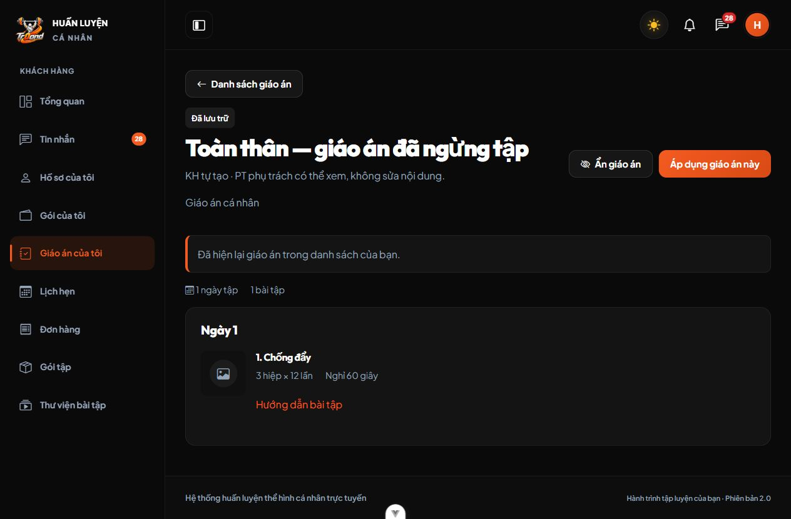

# M05 — Ẩn / hiện lại giáo án tự tạo

Ngày kiểm chứng: 03/10/2026. Quyết định C32, mở rộng giáo án KH tự tạo C31.

## Thay đổi

- Backend: migration000038 thêm `ke_hoach_tap.khach_an_luc` DATETIME(6) nullable; Model cast thời gian; Request validate `da_an`/version và chặn payload giả mạo. Controller lọc danh sách KH, trả cờ quyền/thời điểm; Service khóa KH/giáo án, xử lý ẩn/hiện lại trong transaction. Routes bổ sung `an|hien-lai` chỉ trong nhóm KH.
- Chỉ KH chủ sở hữu bản tự tạo `DA_HUY|LUU_TRU` được ẩn. Hiện lại giữ nguyên trạng thái, bản ẩn không thể áp dụng. PT vẫn đọc toàn bộ giáo án của KH đang phụ trách, không có quyền ẩn/hiện lại thay KH; hết phân công mất quyền.
- Frontend: danh sách có **Hiển thị → Đã ẩn** giữ lựa chọn trong query khi quay lại; chi tiết có xác nhận ẩn/hiện lại, thông báo thành công và backlink đúng mục. PT thấy nhãn KH đã ẩn. Giữ Vue Options API, service chung, layout/theme hiện có.
- Đã chạy `php artisan migrate --force` trên database ứng dụng local: migration000038 DONE; không fresh/rollback/seed lại.

## Kiểm thử thực tế

Windows, PHP/Laravel 13, Vue/Vite, MariaDB 10.4.32. Các kiểm thử Backend tạo database ngẫu nhiên riêng và dọn sau khi chạy.

| Kiểm tra | Kết quả |
| --- | --- |
| `php artisan test --compact --filter=KeHoachTapTest` | 29 tests, 397 assertions, PASS |
| `php artisan test --compact` | 172 tests, 5.216 assertions, PASS |
| `npm run test -- --run` | 16 files, 167 tests, PASS |
| `npm run lint:check` | PASS |
| `npm run build` | PASS |
| Pint cho các file PHP thay đổi | PASS |
| Prettier cho các file FE thay đổi | PASS |
| `git diff --check` | PASS; chỉ cảnh báo chuyển LF/CRLF của Git |

6 ca Backend mới kiểm tra: ẩn/hiện lại và retry, lọc nguồn/ẩn/total/validation, snapshot không đổi, không có lịch/thông báo mới, KH không gói/PT vẫn thao tác; chặn nháp/đang áp dụng/giáo án PT; stale version; hiện lại trước khi áp dụng; PT vẫn đọc nhưng không ghi, hết phân công mất quyền, KH khác/Admin bị chặn và không giả mạo field; rollback khi lưu lỗi và chặn down khi còn dữ liệu ẩn; hai process ẩn cùng bản; hai process ẩn và áp dụng tranh chấp chỉ một thành công, bản đang áp dụng không bị ẩn. Dùng locking thật trên MariaDB, không SQLite/Event fake cho tranh chấp.

3 ca Frontend mới kiểm tra lọc Đã ẩn của KH và PT không lọc; action/phiên bản/double-submit/backlink sau ẩn-hiện; query hiển thị giữ tham số khác. Các kiểm thử cũ về response sau chuyển tài nguyên và focus xác nhận vẫn đạt.

## Kiểm chứng trình duyệt

Dùng tài khoản và database fixture riêng, Backend8017/Frontend5291, session cookie riêng; KH không có gói. Đã thao tác qua UI thật:

1. KH tạo bản có một bài, lưu nháp, áp dụng rồi ngừng áp dụng.
2. KH ẩn bản lưu trữ; danh sách chính trống; chọn Đã ẩn thấy đúng bản và nhãn.
3. Đăng nhập PT đang phụ trách: danh sách vẫn có bản đã ẩn; chi tiết còn bài/thông số, thông báo KH đã ẩn và không có nút sửa/ẩn/hiện lại.
4. Đăng nhập lại KH, mở Đã ẩn và hiện lại; trạng thái vẫn LUU_TRU, xuất hiện nút Áp dụng; quay về danh sách chính thấy bản.

Đã đóng tab thử, xác nhận không còn server thử ở8017/5291 và xóa đúng database fixture. Không thay phiên đăng nhập hay dữ liệu ứng dụng của người dùng.

## Giới hạn / cách xem

- Đã kiểm chứng database thật trên MariaDB10.4.32; chưa chạy trên MySQL8 trong môi trường này.
- M05 giữ bản/snapshot; chức năng ghi nhật ký tập M06 chưa triển khai. Không có DELETE giáo án.
- Tải lại Frontend, đăng nhập KH → Giáo án của tôi → chi tiết bản đã hủy/lưu trữ → Ẩn giáo án. Để hiện lại, chọn Hiển thị → Đã ẩn → Xem giáo án → Hiện lại giáo án. Máy clone/pull cần chạy `php artisan migrate` trong BE trước.
