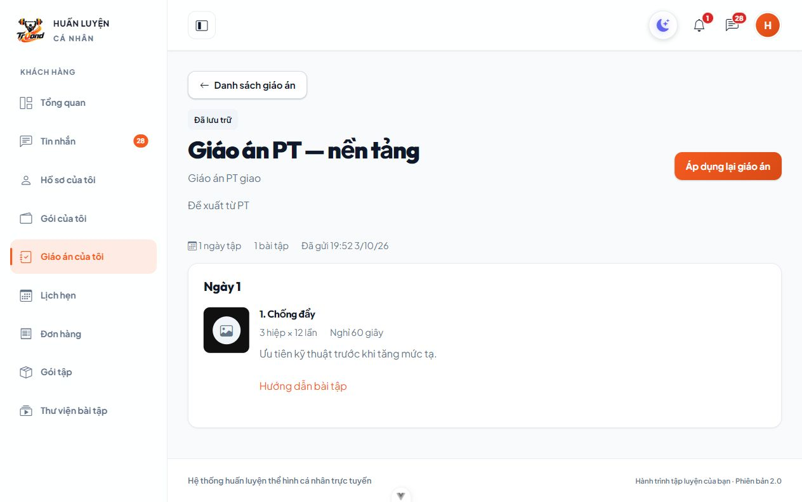
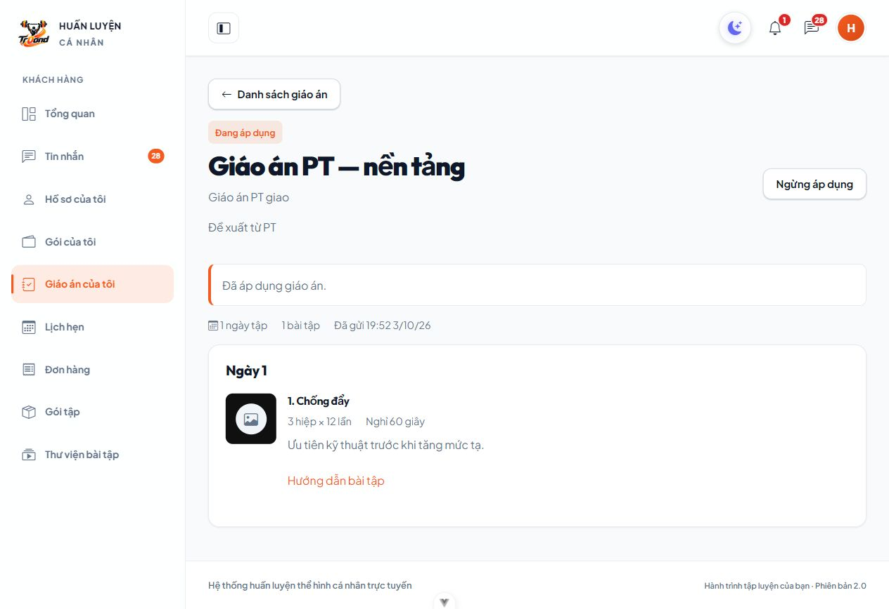
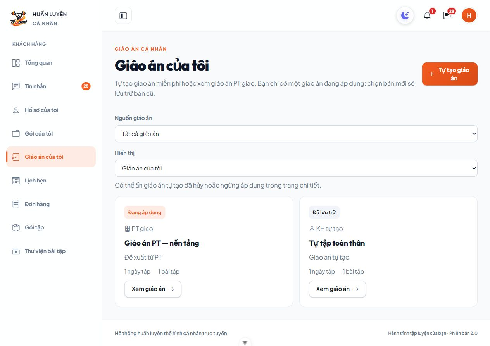

# M05 — KH áp dụng lại giáo án PT đã xác nhận

Ngày kiểm chứng: 03/10/2026. C34 bổ sung chọn lại bản PT lưu trữ, thay giới hạn tương ứng trong C33. Không đổi schema, không cần migration mới.

## Thay đổi

- `BE/app/Services/KeHoachTapService.php`: KH sở hữu bản PT đã gửi và đã xác nhận được áp dụng lại bản lưu trữ qua action `ap-dung`. Khóa KH trước giáo án, kiểm tra version, lưu trữ bản đang dùng và áp dụng bản chọn trong cùng transaction; unique chung C33 giữ một bản đang dùng. Retry bản đã áp dụng trả hiện trạng. Snapshot/bài/thông số và thời điểm gửi/xác nhận/hạn đề xuất giữ nguyên; không thêm thông báo hay lịch tập.
- Việc chọn lại nội dung KH đã xác nhận không yêu cầu gói, phân công cũ hay PT cũ hoạt động. PT cũ không được cấp lại quyền. Nháp, đề xuất chưa xác nhận/quá hạn, bản đã hủy hoặc không có dấu xác nhận bị chặn; không dùng `ap-dung` bỏ qua lần duyệt đầu.
- `KeHoachTapController.php`: cờ `co_the_ap_dung` cho KH chủ sở hữu bản PT đã xác nhận đang `LUU_TRU`, false với PT/trạng thái khác. Không mở quyền sửa/hủy/ẩn giáo án PT.
- `FE/src/views/KeHoachTap/ChiTiet/index.vue`: bản lưu trữ có **Áp dụng lại giáo án** theo cờ API; lời xác nhận và thông báo thành công dùng chung hai nguồn. Khi ngừng, nội dung giải thích có thể chọn lại bản PT đã xác nhận.
- Bổ sung kiểm thử Backend/Frontend; cập nhật PROJECT_RULES, DECISIONS, hợp đồng module/API và README.

## Kiểm thử thực tế

Windows, PHP/Laravel 13, Vue/Vite, MariaDB10.4.32. Backend dùng database kiểm thử riêng; tranh chấp dùng hai process PHP trên database thật.

| Kiểm tra | Kết quả |
| --- | --- |
| `php artisan test --compact` | 182 tests, 5.385 assertions, PASS, gồm đủ39 KeHoachTapTest |
| Ca tái hiện ngừng bản tự tạo rồi chọn lại PT | PASS, 28 assertions trong lần chạy riêng sau sửa kỳ vọng403/404 |
| `npm run test -- --run` | 16 files, 171 tests, PASS |
| `npm run lint:check` | PASS |
| `npm run build` | PASS |
| Pint Service/Controller/KeHoachTapTest | PASS |
| Prettier chi tiết giáo án/FE test | PASS |
| `git diff --check` | PASS; chỉ cảnh báo LF/CRLF của Git |

5 ca Backend mới: tái hiện hai bản đã ngừng rồi chọn lại PT, cờ quyền KH/PT, giữ snapshot/thời điểm và retry không thêm hiệu ứng, hết phân công/PT bị khóa/catalog ngừng vẫn giữ quyền dùng nội dung đã xác nhận; thay bản tự tạo và chặn version cũ; chặn bỏ qua duyệt/nháp/hủy/ngoài scope/Admin/PT; lỗi lưu rollback cả bản chọn và bản đang dùng; hai process chọn lại PT/tự tạo đồng thời chỉ một bản đang áp dụng, không mất dòng bài hoặc tăng thông báo/lịch. FE kiểm tra render nút theo cờ API, nhãn lưu trữ, xác nhận thay bản và gọi đúng endpoint KH/version.

Lần kiểm thử module đầu tiên đạt38/39; một kỳ vọng403 khi PT hết phân công nhận404, đúng hành vi thu hồi scope. Đã sửa kỳ vọng thành404, chạy riêng ca đó PASS rồi chạy toàn bộ182 tests PASS. Không sửa code quyền để làm test đạt.

## Kiểm chứng trình duyệt

Database fixture riêng, Backend8017/Frontend5291, cookie QA riêng, KH không có gói. Tái hiện bằng UI:

1. Ban đầu PT đang dùng, bản tự tạo lưu trữ. KH chọn lại bản tự tạo; PT tự chuyển lưu trữ.
2. KH ngừng bản tự tạo; danh sách hai bản **Đã lưu trữ** như ảnh chủ dự án.
3. KH mở bản PT, thấy **Áp dụng lại giáo án**; bấm và xác nhận trong trang.
4. Chi tiết chuyển **Đang áp dụng**, thông báo **Đã áp dụng giáo án.**, vẫn có ngày/bài/thông số. Danh sách PT đang dùng và bản KH lưu trữ.

Đã đóng tab QA, dừng hai server và kiểm tra cổng8017/5291 không còn lắng nghe; xóa đúng database fixture tạo cho lần kiểm tra. Không sửa dữ liệu hoặc phiên đăng nhập của người dùng trên5173.

## Giới hạn / cách xem

- Đã kiểm chứng MariaDB10.4.32; chưa kiểm chứng MySQL8 ở môi trường này.
- Chỉ bản PT đã được KH xác nhận trước đây được chọn lại; đề xuất mới vẫn xác nhận theo hạn/quyền C19. Bản đã hủy không được phục hồi, giáo án PT không có quyền ẩn/hiện như bản tự tạo.
- Tải lại FE → KH → Giáo án của tôi → bản PT **Đã lưu trữ** → **Áp dụng lại giáo án** → **Đồng ý, tiếp tục**. Không cần migration mới hay seed lại.
