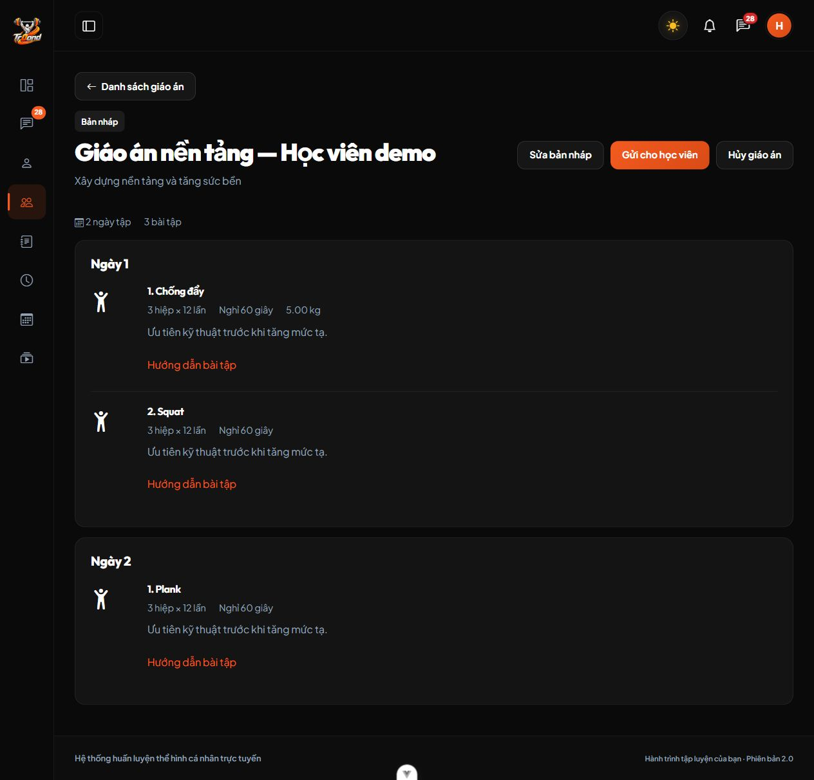

# Kiểm chứng giáo án cá nhân M05

Ngày 03/10/2026, Windows, PHP 8.4.0, Laravel 13, Node.js 22 và MariaDB 10.4.32. Chưa kiểm chứng trên MySQL 8 thật.

## Phần đã triển khai

Backend có models `KeHoachTap`/`BaiTapTrongKeHoach`, FormRequest, Controller và `KeHoachTapService`; routes theo vai trò và quyền phân công. Có tạo/sửa nháp, snapshot catalog, gửi trong hạn 24 giờ, KH xác nhận, thay thế/lưu lịch sử, hủy đề xuất và hai thông báo nghiệp vụ. Migration 000036 giữ dữ liệu cũ và chống rollback làm mất thông số mới. Đã chạy `php artisan migrate --force` trên database ứng dụng; không fresh, rollback hoặc seed dữ liệu ứng dụng.

Frontend Vue Options API có danh sách học viên PT, danh sách giáo án PT/KH, trình soạn cá nhân từ catalog/mẫu đã duyệt và trang chi tiết/xác nhận. Có mức tạ, hiệp, lần lặp, nghỉ, ghi chú, thêm ngày/đổi thứ tự; dùng service Axios và layout/menu/theme hiện có. Chi tiết yêu cầu xác nhận trong trang trước khi gửi, hủy hoặc áp dụng. [Hợp đồng](../features/KE_HOACH_TAP.md).

## Kiểm thử thực sự đã chạy

| Kiểm tra | Kết quả |
| --- | --- |
| Toàn Backend, `php artisan test --compact` | 158 tests, 4.990 assertions PASS |
| Toàn Frontend, `npm run test` | 158 tests trên 16 file PASS |
| Frontend `npm run lint:check` | PASS |
| Frontend `npm run build` | PASS |
| Prettier các file Frontend thay đổi | PASS |
| Pint các file PHP M05 thay đổi | PASS |

15 kiểm thử M05 Backend chạy trên database MariaDB riêng, kiểm tra quyền tài nguyên/vai trò, KH không thấy nháp, đổi PT thu hồi quyền, PT khóa, UUID/phiên bản, catalog ngừng hoạt động, snapshot bất biến, mốc 24 giờ, lưu trữ khi thay thế, vô hiệu đề xuất khác và rollback thông báo/children. Ba kiểm thử dùng hai PHP process thực cùng tranh khóa hàng KH: gửi cùng bản, xác nhận cùng bản và xác nhận hai đề xuất. Migration được thử với dữ liệu giáo án cũ và giới hạn rollback trên database kiểm thử.

9 kiểm thử Frontend M05 kiểm tra payload đúng trường, mức tạ 0 khác bỏ trống, double-submit, giữ UUID/payload khi chưa rõ kết quả, lỗi 409/422, xóa ngày có bài, response đến muộn, hành động theo phiên bản và xác nhận trong trang có focus trước khi gọi API.

## Kiểm tra trình duyệt và giới hạn

Chạy fixture tổng hợp trong database QA riêng, Frontend PT ở 5281/Backend 8012 và Frontend KH ở 5280/Backend 8011. Đã đăng nhập PT, mở học viên, tạo nháp từ giáo án mẫu hai ngày/ba bài, nhập mức tạ 5 kg, lưu và mở chi tiết trong dark theme. Bản ghi tạo qua UI có ID 1 trong fixture, không phải dữ liệu ứng dụng.

Trình duyệt kiểm thử bị hộp thoại JavaScript cũ chặn các click tiếp theo; thao tác điều khiển hộp thoại/đóng tab không khôi phục được. Chưa xác nhận luồng gửi → KH áp dụng bằng trình duyệt trong phiên này. Luồng đã được kiểm tra qua API và kiểm thử Frontend, nhưng không coi đó là bằng chứng E2E trình duyệt. Fixture và các server QA được dọn sau kiểm tra; không thử bằng tài khoản hoặc dữ liệu KH thật.

## Cách chạy và nghiệm thu

1. Máy này đã có migration mới; máy clone chạy `php artisan migrate` trong `BE`, rồi chạy `start.bat` ở thư mục gốc.
2. Admin phân công KH cho PT theo luồng hiện có. PT đăng nhập → **Học viên & giáo án** → chọn KH → **Tạo giáo án**; chọn mẫu đã duyệt hoặc thêm bài, lưu nháp rồi gửi.
3. KH đăng nhập trên trình duyệt khác → chuông hoặc **Giáo án của tôi** → xem chi tiết → **Xác nhận áp dụng** trong 24 giờ.
4. Thử gửi lại/xác nhận lại, hết hạn, đổi PT và thay giáo án; mỗi KH chỉ có một bản đang áp dụng và vẫn giữ lịch sử.

M06 (nhật ký tự tập, kết quả và tiến độ) chưa triển khai trong phiên M05.
