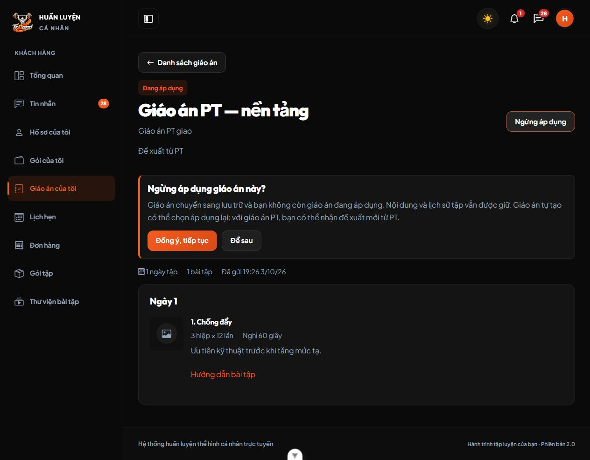
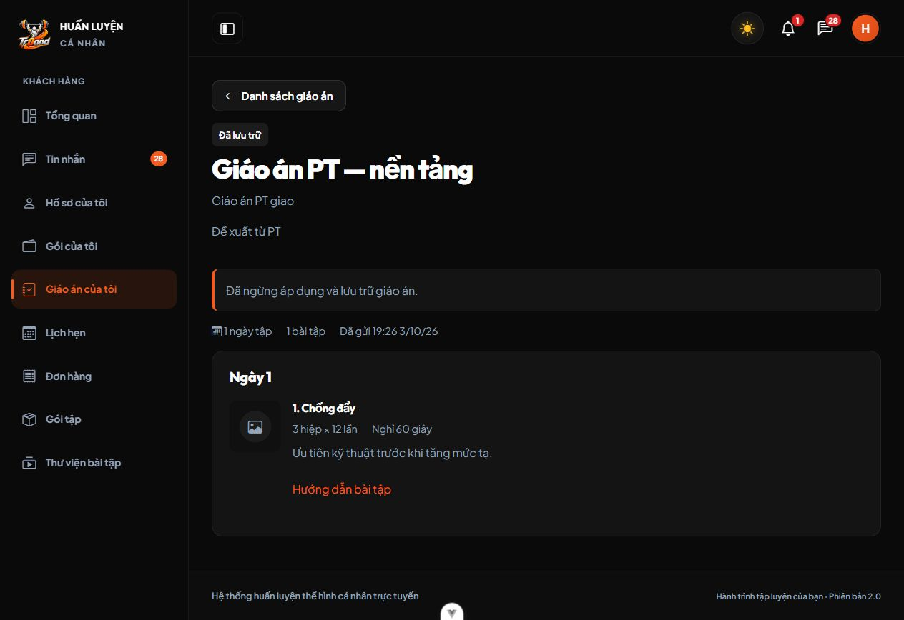
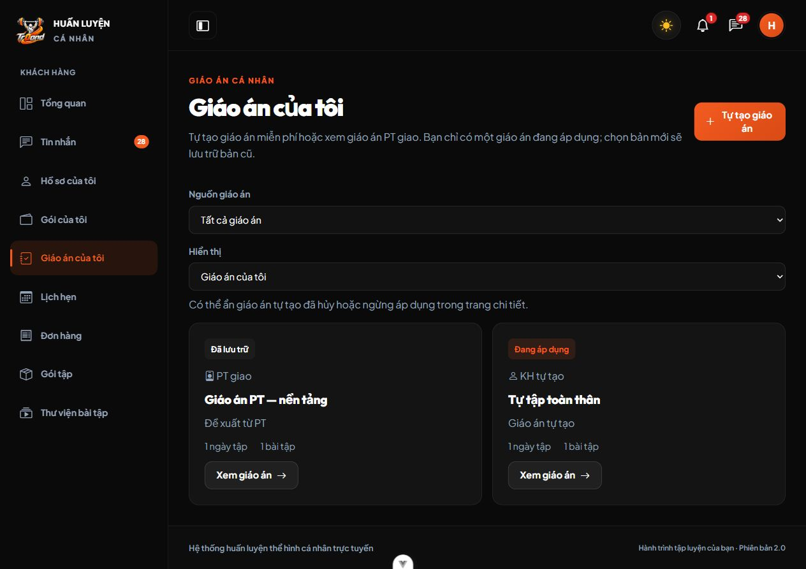

# M05 — Một giáo án đang áp dụng, ngừng giáo án PT

Ngày kiểm chứng: 03/10/2026. Quyết định C33 thay quy tắc hai nguồn áp dụng riêng của C31; giữ C32 về ẩn/hiện giáo án tự tạo.

## Thay đổi

- `KeHoachTapService`: lấy giáo án đang áp dụng chung cho hai nguồn. Khi KH áp dụng giáo án tự tạo hoặc xác nhận đề xuất PT hợp lệ, bản đang dùng được lưu trữ trong cùng transaction. Khóa KH trước, khóa giáo án sau; đề xuất PT có kiểm tra bản bị thay thế để chặn xác nhận từ trạng thái cũ.
- KH chủ sở hữu được ngừng giáo án PT đã nhận kể cả khi phân công PT kết thúc. Endpoint `POST /api/v1/khach-hang/ke-hoach/{id}/luu-tru` kiểm tra quyền tài nguyên, trạng thái và phiên bản; retry bản đã lưu trữ không tạo thay đổi mới. PT/Admin/KH khác không có quyền ngừng thay KH qua endpoint này.
- Controller trả `co_the_luu_tru` cho giáo án PT đang áp dụng. FE dùng nút **Ngừng áp dụng**, xác nhận trong trang và thông báo thành công; danh sách giải thích chỉ có một bản đang dùng. Không xóa giáo án hay các dòng bài tập.
- Migration000039 chuyển unique index `uq_t14_01` thành unique trên `khach_dang_ap_dung_id`. Với KH có nhiều bản đang áp dụng từ dữ liệu cũ, giữ bản có `COALESCE(updated_at, duyet_luc, created_at)` mới nhất, ID lớn hơn khi bằng thời gian; lưu trữ các bản còn lại. Down chỉ đổi index, không kích hoạt lại bản cũ.
- Đã chạy migration000039 trên database ứng dụng local trong maintenance, sau đó mở lại ứng dụng. Không fresh, rollback hoặc seed lại database ứng dụng.
- Mở rộng fixture `chat-ui-fixture.php ke-hoach-chung` để kiểm tra hai nguồn trên database QA riêng.

## Kiểm thử thực tế

Môi trường: Windows, PHP/Laravel 13, Vue/Vite, MariaDB 10.4.32. Backend tạo database kiểm thử riêng; tranh chấp dùng hai process PHP và khóa database thật.

| Kiểm tra | Kết quả |
| --- | --- |
| `php artisan test --compact --filter=KeHoachTapTest` | 34 tests, 470 assertions, PASS |
| `php artisan test --compact` | 177 tests, 5.289 assertions, PASS |
| `npm run test -- --run` | 16 files, 168 tests, PASS |
| `npm run lint:check` | PASS |
| `npm run build` | PASS |
| Pint cho Service, Controller, migration000039, KeHoachTapTest và fixture | PASS |
| Prettier cho danh sách, chi tiết giáo án và FE test | PASS |
| `git diff --check` | PASS |

Các ca mới kiểm tra KH ngừng giáo án PT và retry, stale version, trạng thái chờ xác nhận, hết phân công, KH khác/PT/Admin bị chặn; snapshot và thông báo không đổi khi ngừng; xác nhận PT thay bản tự tạo; đề xuất PT cũ không ghi đè giáo án vừa chọn; hai process KH áp dụng và xác nhận PT chỉ còn một bản đang dùng; rollback khi lưu lỗi; migration giữ bản mới nhất/ID tie-break, bảo toàn dòng bài tập, down không phục hồi trạng thái và unique chặn ghi trực tiếp hai nguồn cùng áp dụng. FE kiểm tra endpoint/ngừng PT, phiên bản, thông báo thành công và lời xác nhận khi thay bản PT bằng giáo án tự tạo.

Lần chạy toàn bộ Backend đầu tiên trùng thời điểm bật maintenance để migrate, gây 11 lỗi HTTP503 ở nhóm GiaoAnMauTest. Đã mở lại ứng dụng và chạy lại toàn bộ; kết quả PASS ở bảng là lần chạy sau, không bỏ qua ca lỗi.

## Kiểm chứng trình duyệt

Dùng database fixture riêng, Backend8017/Frontend5291 và session cookie riêng, KH không có gói:

1. Fixture tạo bản tự tập đang dùng; PT gửi bản mới, KH xác nhận. Danh sách hiện PT đang áp dụng và bản tự tập lưu trữ.
2. KH mở chi tiết PT, thấy **Ngừng áp dụng**; xác nhận có giải thích giữ nội dung/lịch sử.
3. KH ngừng thành công; PT chuyển **Đã lưu trữ**, chi tiết vẫn còn ngày/bài/thông số. Danh sách cả hai bản lưu trữ, không có bản đang áp dụng.
4. KH mở bản tự tạo, áp dụng lại và quay về danh sách: bản tự tạo **Đang áp dụng**, PT **Đã lưu trữ**.

Đã đóng tab và dừng hai server QA, kiểm tra không còn cổng8017/5291 lắng nghe, xóa đúng database fixture của lần kiểm tra này. Không đổi phiên đăng nhập của người dùng trên5173.

## Giới hạn / cách xem

- Đã kiểm chứng trên MariaDB10.4.32; chưa chạy trên MySQL8 trong môi trường này.
- Giáo án PT đã lưu trữ không có nút áp dụng lại qua chức năng tự tập. KH có thể nhận/xác nhận đề xuất mới từ PT; bản tự tạo lưu trữ vẫn được chọn áp dụng lại. Quyền ẩn/hiện chỉ áp dụng cho bản KH tự tạo như C32.
- M05 bảo toàn dữ liệu hiện có; chức năng ghi nhật ký tập M06 chưa triển khai. Ngừng/thay giáo án không tự tạo hay hủy lịch hẹn.
- Tải lại FE → KH → Giáo án của tôi → bản PT đang dùng → Ngừng áp dụng. Nếu chọn giáo án khác, bản cũ tự chuyển lưu trữ.
- Máy clone/pull khác cần chạy migration trong BE khi ứng dụng ở maintenance: `php artisan down`, `php artisan migrate --force`, rồi `php artisan up` sau khi migration thành công.
