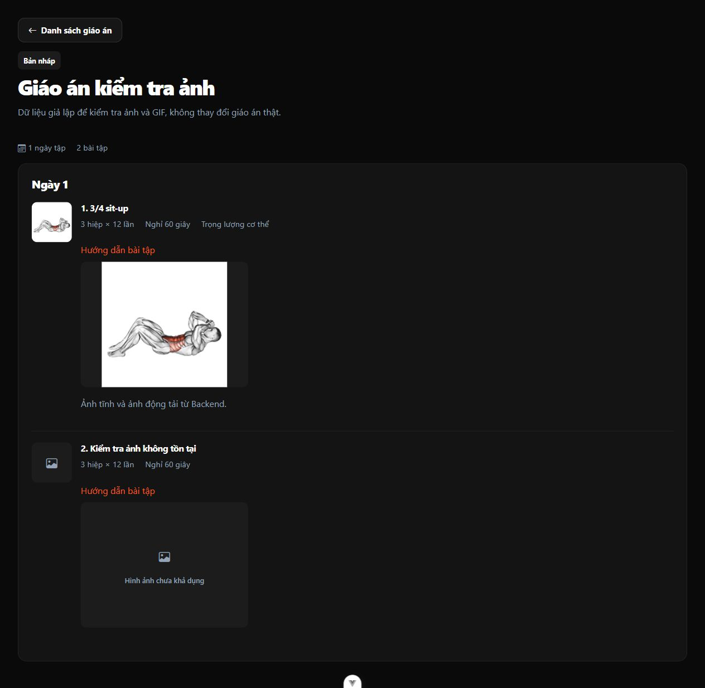

# Sửa ảnh chi tiết giáo án — 03/10/2026

Trang dùng chung `FE/src/views/KeHoachTap/ChiTiet/index.vue` cho PT/KH trước đây gán trực tiếp URL tương đối trong snapshot vào `src`; trình duyệt yêu cầu `/media/bai-tap/...` từ Frontend thay vì Backend. Cả ảnh tĩnh và GIF nay đi qua `baiTapService.urlMedia`, giữ kiểm tra đường dẫn media cho phép và lấy origin từ cấu hình API. Không sửa snapshot, dữ liệu giáo án hoặc cấu hình môi trường.

Dùng lại `AnhBaiTap` để có trạng thái tải và fallback khi thiếu/hỏng. `FE/src/assets/keHoachTap.css` giữ thumbnail 72×72, khung GIF rộng tối đa 300px và không áp kích thước thumbnail lên ảnh động.

Kiểm tra thực tế trên Windows/Node: 26 tests thuộc `keHoachTap.spec.js` và `baiTap.spec.js` PASS, bao gồm render trang cho cả PT/KH với URL JPG/GIF đầy đủ từ Backend; build, ESLint và Prettier file thay đổi PASS.

Kiểm tra trình duyệt bằng component thật với layout và giáo án giả lập trên trang tạm ở 5290; media public từ Backend đang chạy ở 8000. JPG và GIF đều tải thành công (`naturalWidth=180`), khung hiển thị lần lượt 72×72 và 300×225. Giả lập URL 404 cho ảnh/GIF cho thấy fallback, không còn biểu tượng ảnh vỡ. Đây không phải kiểm tra đăng nhập hay quyền API trên giáo án thật. Trang/server QA đã dọn; không sửa dữ liệu ứng dụng.

Tải lại trang chi tiết giáo án PT/KH để xem kết quả. Không cần migration hoặc seed lại.
