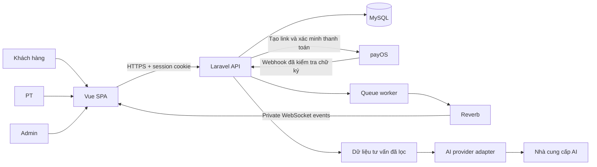

# Kiến trúc đề xuất

## Thành phần

Website Vue, một backend, một database, một Reverb process và một queue worker là baseline web. Theo C40/C41 (05/10/2026), thêm app React Native + Expo/JavaScript trong `Mobile/` cho KH và PT. MB1 dùng bearer Sanctum cho native, HTTP client và hồ sơ thật; website giữ cookie/session/CSRF. MB2–MB5 nối lịch/tập luyện, Reverb/thông báo, đăng ký/reset, gói/thanh toán và chatbot vào cùng backend; UI1 mẫu tách riêng. MB5 kiểm tra nhà cung cấp giả lập; bản cài/điện thoại thật chưa nghiệm thu. Sơ đồ trên mô tả phần web hiện có. Không thêm service Python, vector DB hoặc microservices cho bản đầu.

## Tổ chức code

Các vị trí dưới đây tính từ thư mục gốc `E:/Dự án tốt nghiệp`. `FE/`, `BE/` và `Mobile/` là các thư mục mã nguồn ngang cấp; tài liệu nằm trong `md/`. `Base/` và thư mục mẫu `.example` riêng đã được bỏ.

| Vị trí | Trách nhiệm |
| --- | --- |
| `Mobile/` | App React Native + Expo cho KH/PT; UI1 mẫu và MB1 xác thực/hồ sơ thật |
| `FE/src/views/` | Pages theo Admin/PT/KhachHang |
| `FE/src/components/` | Form, bảng, thông báo và thành phần dùng chung |
| `FE/src/layouts/` | Layout khách hàng/PT/Admin/auth |
| `FE/src/router/` | Lazy routes, meta vai trò/layout và guard |
| `FE/src/services/` | Hàm gọi API theo module |
| `FE/src/stores/` | Auth, hội thoại, thông báo dùng chung |
| `FE/src/utils/` | HTTP client, Echo, thời gian, xử lý lỗi |
| `BE/app/Http/Controllers/Api/` | Request/response và gọi nghiệp vụ |
| `BE/app/Http/Requests/` | Validation input |
| `BE/app/Policies/` | Role + ownership/resource scope |
| `BE/app/Services/` | Transaction, trạng thái, rule và adapter AI |
| `BE/app/Models/` | Eloquent relations/queries |
| `BE/app/Events/`, `BE/app/Jobs/` | Broadcast sau commit, xử lý nền |
| `BE/routes/` | API routes và kênh private |
| `BE/database/` | Migration, factory, seeder |
| `BE/tests/` | Feature/unit và integration phù hợp |

Đã có Laravel runtime trong `BE/`, Vue 3 Options API/JavaScript trong `FE/` và ứng dụng React Native + Expo trong `Mobile/`. Ví dụ triển khai cần lấy từ module đang chạy, đối chiếu route, validation, quyền và test của module đó. Thiết kế dữ liệu nằm ở [DATABASE_DRAFT.md](DATABASE_DRAFT.md); migrations nằm trong `BE/database/migrations/`. Trạng thái và bằng chứng từng module được ghi tại [md/README.md](README.md) và các tài liệu kiểm chứng.

## Luồng HTTP thông thường

Vue page → module service → Axios chung → Laravel route/auth → FormRequest → Policy → Service khi cần → Eloquent/transaction → JSON/resource → UI.

CRUD đơn giản không bắt buộc có service nếu không có quy tắc nhiều bước. Laravel service không đồng nghĩa Repository/DDD.

## Luồng chat

Vue tạo ID gửi ổn định → Laravel kiểm tra người tham gia/phân công → lưu message → commit → queue phát event → private channel → Vue hợp nhất theo ID. Lịch sử tải qua HTTP có phân trang; reconnect tải bù theo cursor. Không dựa vào WebSocket để lưu tin.

Kiểm tra quyền lúc subscribe chưa đủ cho việc đổi PT. Thiết kế thu hồi phải được kiểm chứng với socket cũ đang mở; tham khảo yêu cầu tại `md/features/REALTIME_CHAT.md` trước khi chọn cách dispatch.

## Luồng thanh toán payOS

KH tạo đơn → Backend lưu snapshot/hạn 15 phút → tạo link payOS với `expiredAt` tương ứng → KH thanh toán → Backend xác minh webhook/đối chiếu mã đơn, số tiền, trạng thái → transaction ghi nhận/kích hoạt gói → UI tải trạng thái server. Không giữ khóa/transaction DB khi gọi payOS; retry/webhook lặp không cấp hai gói. Tiền đến sai điều kiện ghi nhận để Admin đối soát, hoàn tiền thủ công có lưu kết quả; thông báo tới muộn nhưng tiền trong hạn xử lý bình thường. Nguồn: [API payOS](https://payos.vn/docs/api/), [PHP SDK](https://payos.vn/docs/sdks/back-end/php/).

## Luồng AI

KH gửi câu hỏi → Laravel kiểm tra auth/snapshot quyền chatbot/hiệu lực/hạn mức ngày/rate/input → lấy history server và dữ liệu nguồn đã lọc → Gemini adapter → kiểm tra schema/IDs → dựng thẻ catalog từ DB → lưu câu trả lời hợp lệ/tính lượt một lần → trả UI.

Quyền chatbot/số lượt hỏi mỗi ngày và số buổi PT cấu hình riêng, giữ snapshot đã mua. Kích hoạt khi Backend xác nhận payOS; gói kết hợp chung thời hạn theo ngày đủ 24 giờ; mỗi KH một gói khả dụng, gói chatbot riêng không cần PT. Chatbot chỉ tính câu trả lời hợp lệ/lỗi không mất lượt/retry không tính lặp, cấp lại 00:00 giờ Việt Nam; hết buổi PT còn thời hạn vẫn dùng chatbot. Cơ chế giữ lượt nguyên tử không giữ khóa suốt cuộc gọi AI. Catalog/FAQ miễn phí, không có chatbot miễn phí.

Không giữ DB transaction trong thời gian chờ provider. Không cho mô hình tự sinh SQL, tự lấy user ID, gọi URL tùy ý hoặc viết dữ liệu nghiệp vụ.

## Môi trường

Dev dự kiến: FE 5173, API 8000, Reverb 8080, MySQL 3306. Chưa bật process nào; nếu trùng với dự án khác thì cấu hình port riêng. Cùng hostname cho cookie auth.

Deploy: FE dưới domain chính, API cùng domain qua reverse proxy; HTTPS/WSS, PHP-FPM, MySQL, supervisor/service quản lý Reverb và queue. Hướng dẫn triển khai thực tế chỉ viết sau bootstrap.

## Xuyên suốt hệ thống

- UTC trong DB; giao diện giờ Việt Nam (`Asia/Ho_Chi_Minh`) theo D09 đã chốt; deadline bằng giờ server. Giữ lịch sử suốt đồ án, không tự purge; khóa tài khoản không xóa lịch sử.
- Một account/ba role, profile riêng; không dùng email/token từ UI để chọn tài nguyên tùy ý.
- Khóa/constraint/chống trùng trên server cho các chuyển trạng thái quan trọng.
- Logs có request ID, trạng thái, thời gian xử lý; không chứa secrets hoặc nội dung cá nhân đầy đủ.
- Backup/restore phải được thử; không chỉ viết “có backup” trong báo cáo.
