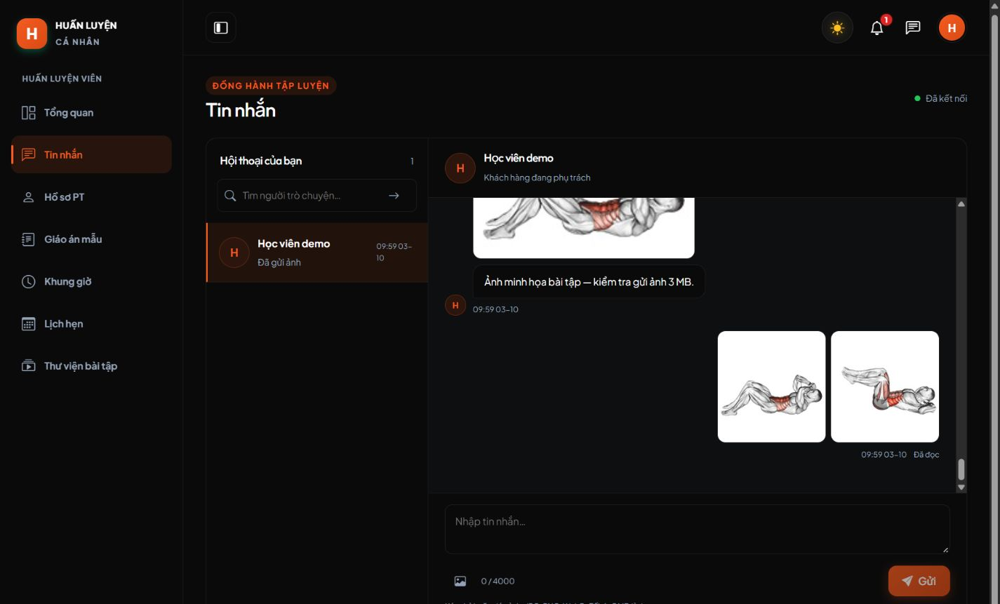
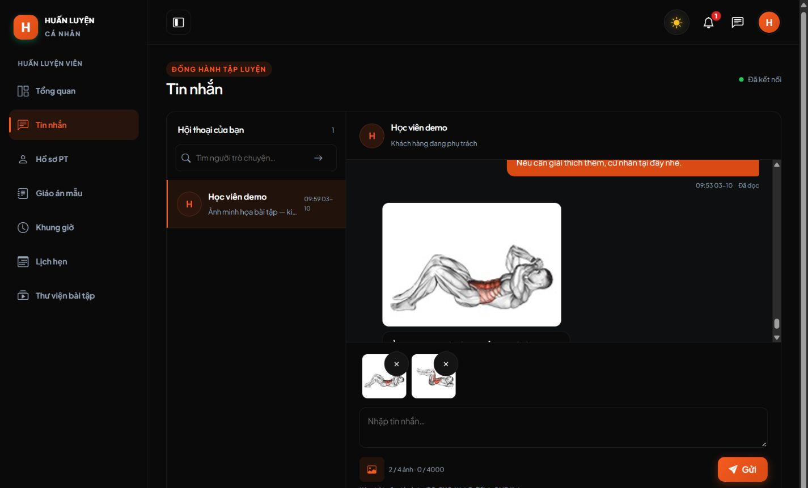
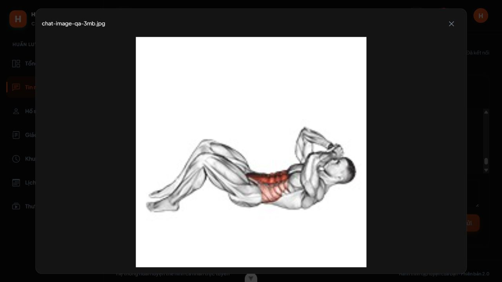
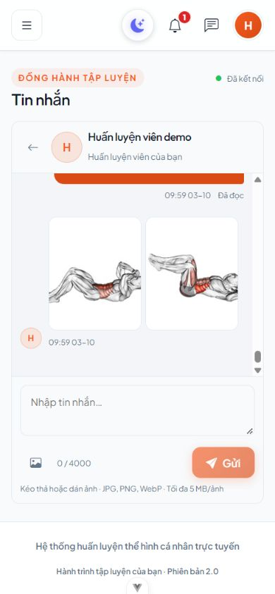
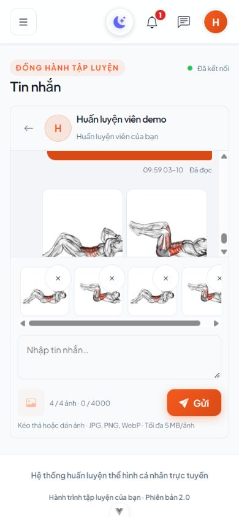
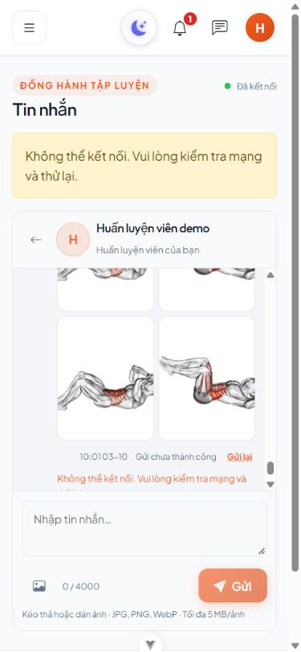
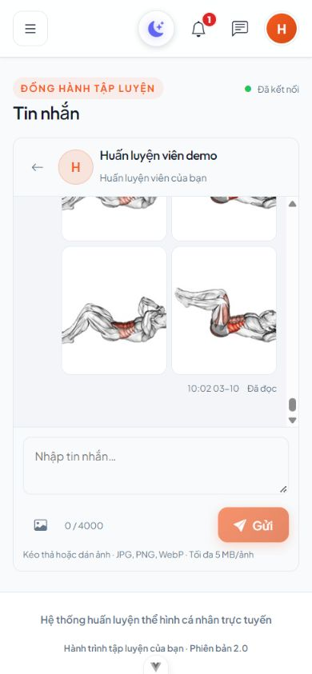
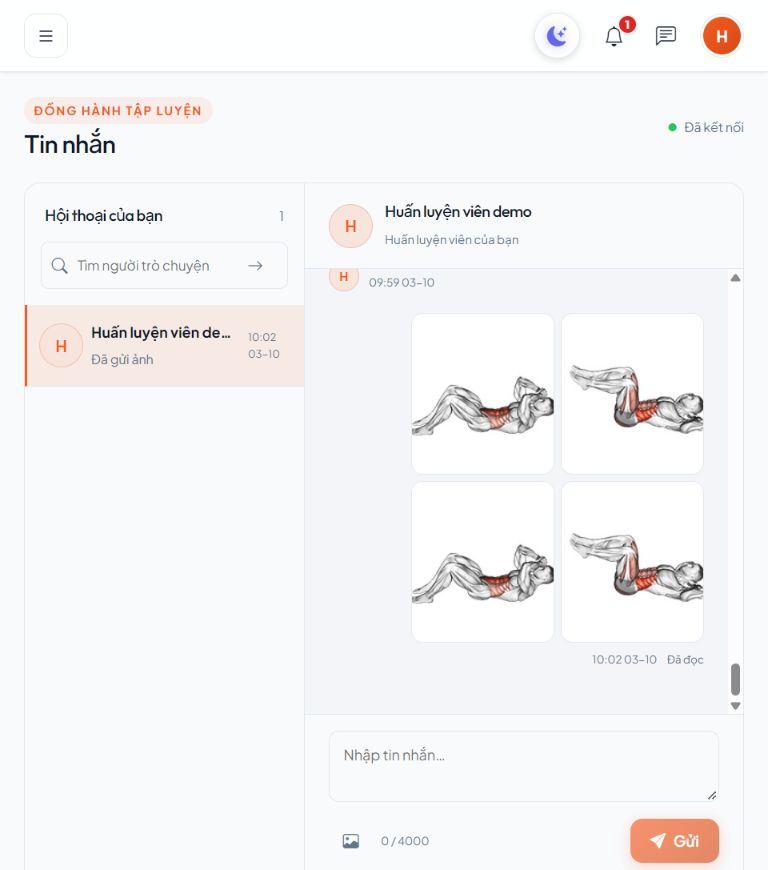

# Gửi ảnh trong chat KH–PT — 03/10/2026

## Phạm vi và cách xem

Theo yêu cầu C30, bổ sung vào trang Tin nhắn KH/PT hiện có: nút chọn ảnh, xem trước/bỏ ảnh, kéo thả, dán Ctrl+V, chú thích tùy chọn, gửi nhiều ảnh, xem lớn, trạng thái gửi và gửi lại. Tối đa 4 JPG/PNG/WebP/tin, 5 MB/ảnh; Backend chặn ảnh quá 8.000 pixel mỗi chiều. Admin không được đọc chat riêng.

Máy này đã chạy migration000035 trên database ứng dụng, giữ lịch sử. Đóng cửa sổ Backend cũ, chạy lại `start.bat` ở thư mục gốc và tải lại trang; vào **Tin nhắn**, chọn hội thoại đang có phân công. Backend dùng `serve:local` để PHP con nhận tệp 5M/body 24M. Máy clone chạy `php artisan migrate` trong BE trước; không fresh/rollback/seed lại.

## Thay đổi

- BE: migration000035 thêm JSON nullable `tin_nhan.anh`; ChatRequest kiểm tra ảnh, ChatService lưu riêng tư/chống trùng/dọn tệp khi lỗi; ChatController/route phục vụ bytes sau kiểm tra scope; lỗi413 có hướng dẫn dung lượng. Command ChayLocal và start.bat đặt giới hạn PHP con.
- FE: chatService dùng multipart và tải blob qua endpoint có session; AnhTinNhan tải khi gần viewport/hủy request; trang TinNhan có preview, paste/drop, grid, dialog và retry; chat.css giữ bố cục responsive.
- Dữ liệu: không trả đường dẫn/hash ra FE; UUID/chú thích/SHA-256 theo thứ tự ảnh quyết định retry; tin chữ cũ không đổi. Ảnh lưu `storage/app/private/chat`, không cần storage:link. Không tự purge; rollback từ chối gỡ metadata nếu đã có ảnh.
- Tài liệu: DECISIONS C30, hợp đồng REALTIME_CHAT, từ điển/draft database và README FE/BE/root/migrations.

## Kiểm tra đã thực sự chạy

Windows, PHP8.4/Laravel13, MariaDB10.4.32, Node22.20/Vue3/Vite. Backend test tạo database riêng; Storage::fake cô lập tệp, không gửi ảnh vào hội thoại người dùng.

| Kiểm tra | Kết quả |
| --- | --- |
| Toàn Backend `php artisan test --compact` | 142 tests / 4.789 assertions PASS |
| Toàn FE `npm run test -- --run` | 146 tests / 14 files PASS |
| FE lint:check / format:check / build | PASS |
| Pint các PHP thay đổi | PASS |
| `start.bat --check` | PASS; chỉ kiểm tra chương trình/thư viện/file cấu hình |
| Migration000035 database ứng dụng | DONE, không reset |
| `git diff --check` | Không lỗi whitespace; có thông báo chuẩn hóa CRLF/LF |

ChatTest kiểm tra MIME thật/tệp giả/SVG/quá 5 MB/quá 4 ảnh/quá chiều rộng, gửi không chú thích, retry một record/một tệp và xung đột bytes/chữ. Kiểm tra ảnh người ngoài/Admin/PT cũ bị từ chối, KH còn lịch sử nhưng không gửi khi kết thúc phân công, tài khoản khóa; lỗi ghi DB rollback/dọn ảnh. Hai process MariaDB cùng UUID/ảnh chỉ lưu một tin/một tệp. Test Reverb thật gồm ảnh, recipient đọc metadata/bytes qua HTTP, socket chỉ nhận tín hiệu và PT cũ không nhận nội dung.

FE test kiểm tra giới hạn, ảnh-only/retry giữ File+UUID, clipboard/drop giữ bản nháp chữ/chặn tệp sai và mất quyền, dọn preview/hủy upload khi hết phiên, ảnh trả muộn sau unmount không tạo blob riêng tư lại. Kéo thả được kiểm tra handler tự động; chưa thao tác kéo tệp từ desktop bằng trình duyệt.

## Kiểm tra trình duyệt thật

Fixture QA riêng `kiem_tra_chat_ui_13c37e585d132b88`, Backend8011/8012, FE5280/5281, Reverb8082. KH/PT đăng nhập hai session riêng, dữ liệu demo và ảnh catalog được phép sử dụng. Disk upload QA đặt dưới `BE/storage/framework/testing/chat-ui/<database>`, không dùng thư mục ảnh ứng dụng.

- KH chọn JPEG 3.145.728 bytes có chú thích, ảnh hiện Đã đọc và PT nhận realtime. Tệp QA là JPEG catalog được thêm padding sau EOI để kiểm tra mức tải lên thực tế vượt php.ini mặc định 2M, không phải ảnh khách hàng.
- PT xem lớn/đóng Escape, chọn hai ảnh, bỏ/chọn lại rồi gửi không chữ; KH nhận ảnh.
- Điện thoại390×844: Ctrl+V PNG tạo preview `clipboard.png`, bỏ ảnh được; chọn bốn ảnh, picker bị khóa khi đủ bốn. Clipboard thử nghiệm được dọn sau kiểm tra.
- Tạm dừng đúng Backend QA; gửi bốn ảnh báo lỗi và giữ preview; khởi động lại rồi Gửi lại thành công, một tin đã lưu/đọc.
- Desktop1440×1000 dark, tablet768×1024 light và mobile390×844: ảnh decode được, document không tràn ngang trên tablet/mobile. PT console không có warn/error; lỗi mạng KH trong bài retry là có chủ đích.

## Giới hạn

Chỉ ảnh JPG/PNG/WebP; chưa nén ảnh/bỏ EXIF, video/PDF/tệp khác, progress phần trăm, upload nền sau đóng trang hoặc lưu bản nháp qua tải lại. Tệp nháp/lỗi giữ trong bộ nhớ trang; retry trong cùng phiên. Ảnh đã tải không thể thu hồi bản sao người nhận đã lưu; mọi request mới vẫn kiểm tra quyền hiện tại.

Chưa nghiệm thu trên MySQL8 hoặc máy triển khai HTTPS/WSS. Production phải cấu hình PHP/web server body ít nhất 24 MB, mỗi tệp ít nhất 5 MB, và quyền ghi disk riêng tư. Giữ lịch sử theo D09; không có tác vụ tự xóa ảnh. QA tab/server/database/tệp riêng đã được dọn sau kiểm tra; không dừng server người dùng.
