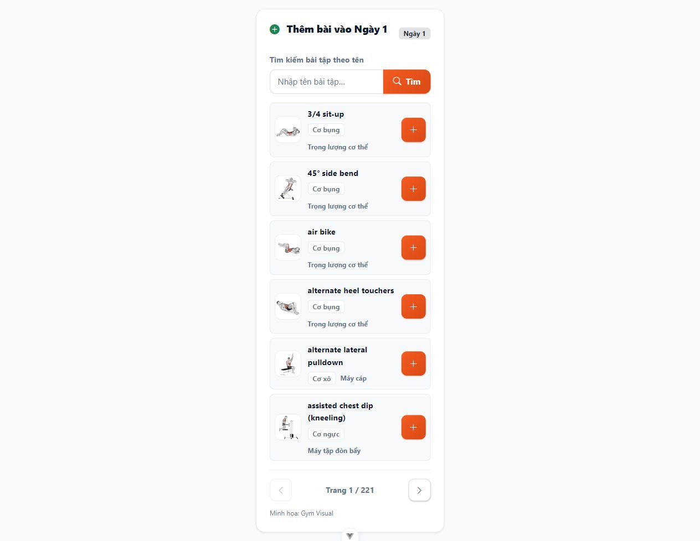
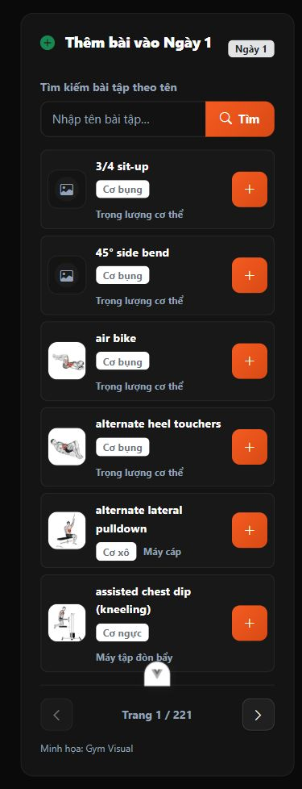

# Ảnh thu nhỏ trong cột chọn bài — 03/10/2026

Component dùng chung `FE/src/components/ChonBaiTapGiaoAn.vue` thêm ảnh tĩnh 48×48 bên trái tên bài, bo góc 12px; giữ tên, nhóm cơ, dụng cụ và nút thêm bên phải. Áp dụng cho trình soạn giáo án cá nhân PT và giáo án mẫu Admin. URL qua `baiTapService.urlMedia`, không tải GIF tự động. Dùng `AnhBaiTap` có lazy loading, khoảng ảnh cố định và fallback khi thiếu/hỏng. Có ghi công Gym Visual dưới danh sách có media.

Đã chạy build, lint:check và Prettier file thay đổi trên Windows/Node 22, đều PASS. Thay đổi trình bày nên không thêm test nghiệp vụ hoặc sửa API/migration.

Đã kiểm tra bằng trình duyệt với component thật và catalog public, trang QA tạm ở 5290 và Backend đọc ở 8015. Cột rộng 340px: sáu ảnh tải thành công, tên dài xuống dòng và nút thêm còn hiển thị. Kiểm tra dark theme với hai ảnh thiếu/hỏng được giả lập chỉ trong trang QA: hiển thị fallback. Viewport mobile 390×844: chiều rộng nội dung bằng viewport 390px, sáu khung ảnh vẫn 48px; không tràn ngang. Trang/server QA đã dọn, không sửa dữ liệu catalog hoặc tài khoản.

Mở trang tạo/sửa giáo án PT hoặc Admin, tải lại để xem ảnh. Không cần seed lại hoặc chạy migration.

## Bổ sung GIF khi rê chuột

Theo yêu cầu chủ dự án, thẻ bài chuyển ảnh tĩnh sang GIF khi pointer chuột đi vào hoặc nút thêm nhận focus bàn phím. Rời thẻ trở về JPG; chỉ có một GIF đang được chọn, không tải trước GIF cho cả danh sách. Pointer cảm ứng và tùy chọn giảm chuyển động giữ ảnh tĩnh. GIF thiếu/hỏng quay về JPG, không lặp tải URL lỗi trong cùng lần mở component.

API danh sách bài bổ sung `gif_url` công khai; không thêm hướng dẫn JSON hoặc đường dẫn nguồn nội bộ. Backend filter/quyền không đổi. Đã kiểm tra qua trình duyệt: ban đầu sáu JPG, trỏ vào bài đầu chỉ một GIF tải thành công, rời thẻ tất cả về JPG; Tab tới nút thêm mở GIF; giả lập GIF 404 trong trang QA giữ lại JPG. Không thêm bài hoặc sửa dữ liệu ứng dụng.

17 Backend tests module bài tập/2.966 assertions PASS; toàn FE 158 tests PASS, build/lint/Pint và Prettier file thay đổi PASS. Không cần migration/seed. Server/trang QA đã dọn.

## Hover phóng nhẹ và viền cam

Thẻ chọn bài PT/Admin phóng 1,03 lần khi rê chuột, đổi viền sang màu cam chủ đạo và thêm bóng cam nhẹ, chuyển tiếp 180 ms. Transform không thay kích thước bố cục; áp dụng hover trên thiết bị có con trỏ chính xác. Focus bàn phím có viền/bóng cùng màu; tùy chọn giảm chuyển động tắt zoom và transition. Giữ nguyên GIF và nút thêm.

Đã chạy build, ESLint và Prettier component thay đổi, đều PASS. Bổ sung này chỉ đổi CSS; không chạy lại kiểm thử Backend hoặc thêm test nghiệp vụ. Ảnh ở trên thuộc kiểm tra GIF trước khi bổ sung viền/zoom.
