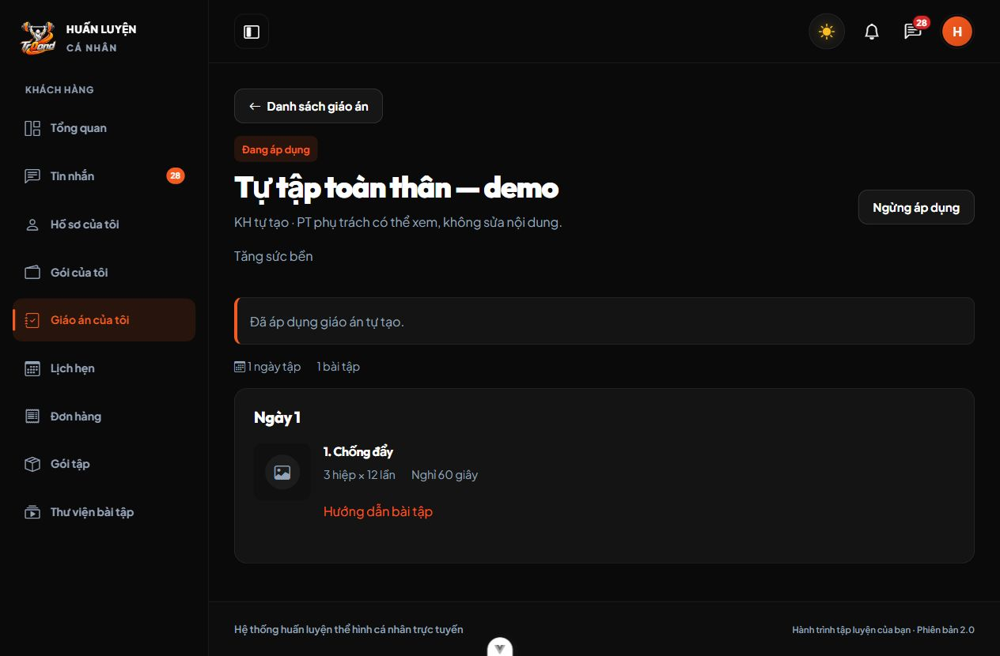
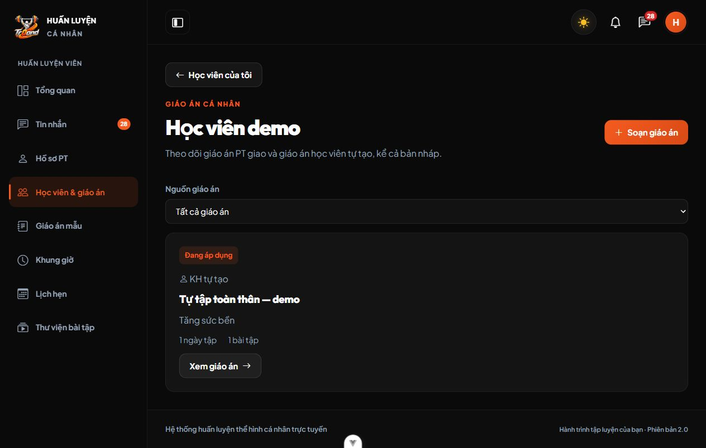

# M05 — KH tự tạo giáo án, 03/10/2026

Theo C31, KH tạo và tự áp dụng giáo án từ catalog dù chưa mua gói/chưa có PT; PT hiện tại đọc tất cả bản tự tạo của KH đang phụ trách, kể cả nháp, biết bản đang dùng nhưng không sửa thay. Bản tự tạo đang dùng riêng với bản PT giao. Nháp được sửa; áp dụng chốt snapshot, bản đã áp dụng bất biến, giữ lịch sử và chọn lại bản lưu trữ. Không thêm lịch/nhật ký hoặc trừ buổi trong phần này.

## File/module và cách chạy

- Migration000037 thêm nguồn mặc định PT, liên kết PT/phân công nullable, unique đang áp dụng theo nguồn; giữ FK và dữ liệu. Đã chạy `php artisan migrate --force` trên database ứng dụng, không fresh/rollback/seed. Máy clone chạy `php artisan migrate`.
- `KeHoachTapService`, Request/Controller/routes có phạm vi KH/PT, tạo/sửa/hành động KH, UUID/phiên bản, khóa KH và transaction; xác nhận PT vẫn theo hạn 24 giờ. Dữ liệu tự tạo không phụ thuộc gói hoặc phân công khi KH thao tác.
- Vue dùng service API chung, trình soạn hiện có cho cả KH/PT. Danh sách có nhãn/lọc nguồn; chi tiết có áp dụng/ngừng áp dụng và xác nhận trong trang. PT đọc bản KH tự tạo không có nút sửa/hủy/áp dụng.
- KH: **Giáo án của tôi → Tự tạo giáo án → Lưu bản nháp → Áp dụng giáo án này**. PT: **Học viên & giáo án → học viên → Xem giáo án**. Tải lại ứng dụng sau khi cập nhật.

## Kiểm thử thực sự

Windows, PHP 8.4, Laravel 13, Node 22; database MariaDB 10.4.32 riêng được tạo/xác minh tên trước chạy và dọn sau kiểm thử. Chưa kiểm chứng trên MySQL 8 thật.

- Toàn Backend: **166 tests, 5.102 assertions PASS**. M05 có 23 tests, thêm 8 ca cho KH không có gói/PT, tự sửa/áp dụng/lưu trữ/chọn lại, quyền PT chỉ đọc và đổi PT thu hồi, giả mạo nguồn/ownership, tách bản PT, ngày thiếu/catalog ngừng/version cũ, rollback trạng thái/snapshot và migration giữ bản cũ/chặn rollback khi có bản tự tạo.
- Hai PHP process thật cùng áp dụng hai bản tự tạo trên MariaDB: khóa KH tuần tự hóa, chỉ một bản tự tạo đang dùng, bản còn lại lưu trữ. Bản commit sau là lựa chọn cuối cùng. Retry cũ của bản đã bị thay không tự kích hoạt lại.
- Toàn Frontend: **164 tests PASS**. Bổ sung 4 ca về trình soạn KH không cần phân công, tạo KH/double-submit/đường dẫn, sửa theo version và hành động tự áp dụng. Giữ các ca ảnh/GIF, quyền UI, 409/422 và response đến muộn.
- Build, lint:check, Prettier các file Vue/JS/test thay đổi và Pint PHP thay đổi PASS.

## Trình duyệt

Fixture tổng hợp trong database `kiem_tra_chat_ui_…` riêng, không có gói; Backend8017 và Frontend5291, cookie QA riêng. KH demo đăng nhập, mở **Tự tạo giáo án**, nhập tên/mục tiêu, thêm Chống đẩy, lưu nháp rồi xác nhận tự áp dụng thành công. Đăng xuất KH và đăng nhập PT demo: danh sách học viên cho thấy bản **KH tự tạo — Đang áp dụng**; chi tiết chỉ xem, không có nút sửa/hủy/áp dụng. Các bài fixture không có media nên hiển thị fallback, không thay media thật.

Không kiểm thử giao dịch payOS, nhật ký M06 hoặc MySQL8 trong phiên này. Fixture/server/tab QA được dọn sau kiểm tra; không thay tài khoản/giáo án thật ngoài migration giữ dữ liệu.
