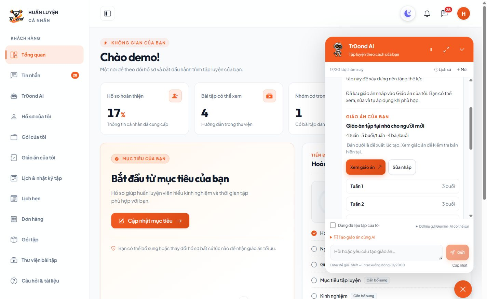
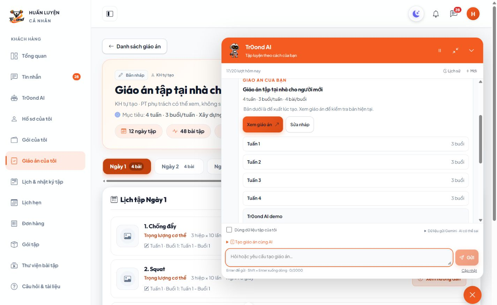
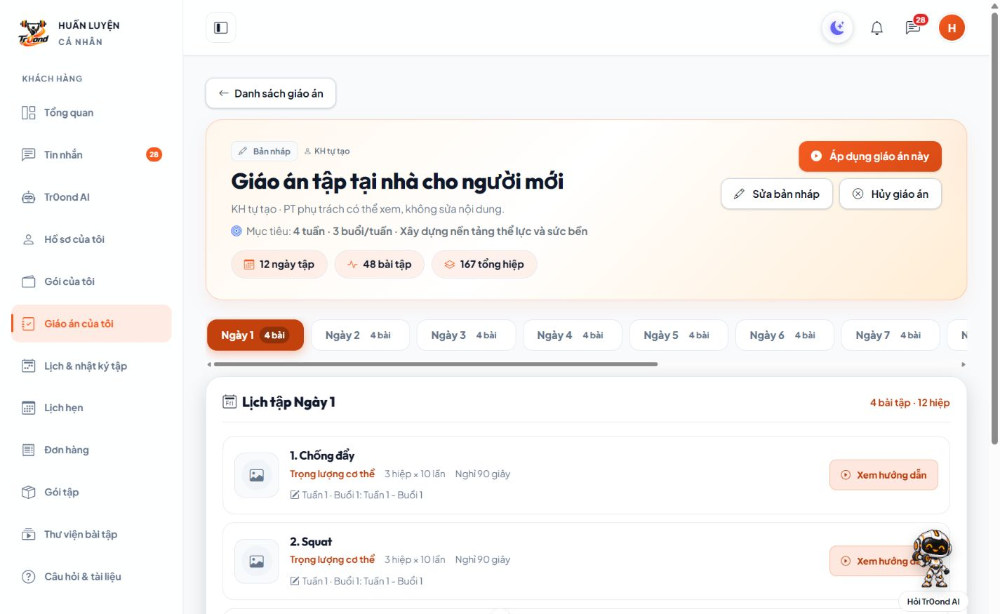
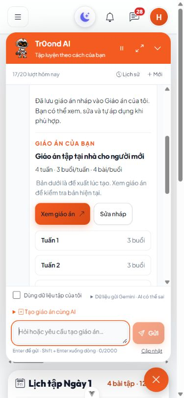
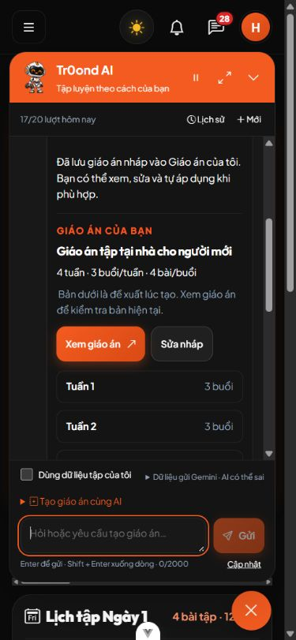
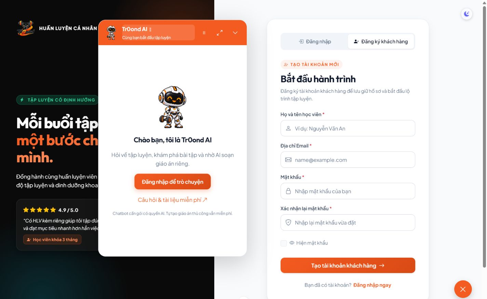
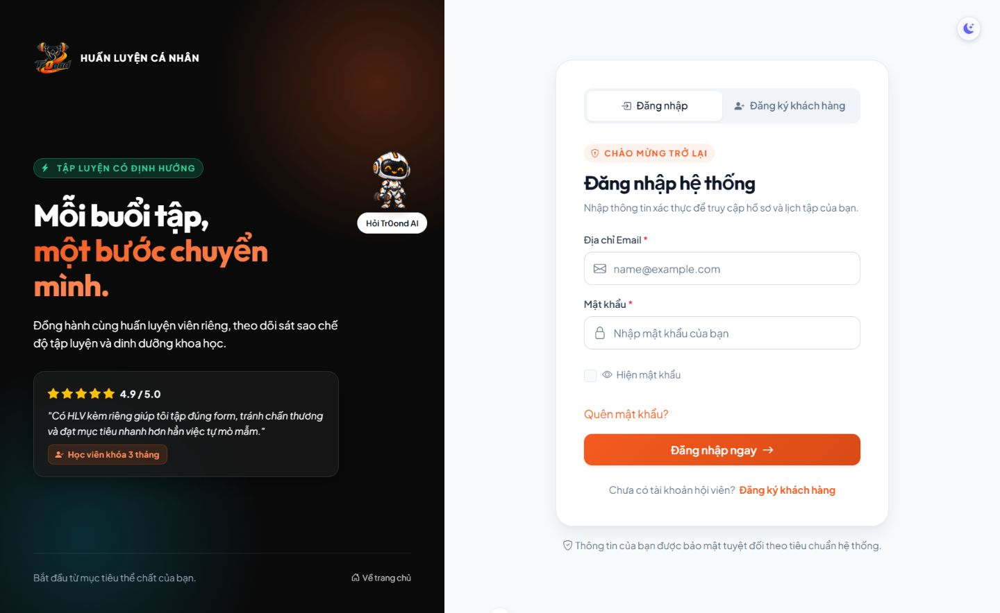

# C37 — Cửa sổ chatbot và giáo án AI (04/10/2026)

## Kết quả

FitForge AI có cửa sổ nổi góc dưới, dùng GIF mascot của chủ dự án làm nút mở và avatar. Header có tạm dừng mascot, phóng to/thu nhỏ và đóng. Ô nhập gọn; form buổi/tuần, số tuần, bài/buổi mặc định3/4/4 chỉ soạn yêu cầu, KH bấm gửi để gọi AI. Có lịch sử và hội thoại mới. Thu gọn/chuyển trang không hủy câu đang gửi; đăng xuất hoặc đổi tài khoản tháo nội dung riêng. Trang chatbot đầy đủ vẫn dùng cùng component, ẩn cửa sổ nổi ở trang đó. Khách vãng lai có lời mời đăng nhập/FAQ, không gọi Gemini. PT/Admin không cấp thêm quyền chatbot.

KH có gói AI còn hạn/lượt yêu cầu tạo nháp. Gemini chỉ dùng ID bài thật từ danh sách ứng viên. Backend xác định số buổi/bài, kiểm tra đủ từng buổi, không lặp bài trong buổi, giới hạn thông số và recheck catalog trước lưu. Lưu nguồn KHACH_HANG, trạng thái NHAP qua KeHoachTapService. Nháp, assistant và lượt hoàn tất cùng transaction; replay UUID trả cùng kết quả, không tạo lần hai. Bản đang tập, lịch tập, lượt PT giữ nguyên. KH dùng luồng xem/sửa/áp dụng đã có; PT hiện tại đọc được theo phân công, không sửa nháp KH.

Không cần migration mới cho C37; metadata liên kết và đề xuất ban đầu lưu trong JSON nguồn assistant. Nếu KH sửa nháp sau đó, cửa sổ vẫn ghi rõ đây là đề xuất lúc tạo; link mở bản hiện tại. Bản kế hoạch12 ngày đánh số tương ứng12 buổi trong 4 tuần, chưa phải lịch có ngày giờ.

## Kiểm thử đã chạy

- Windows/PHP8.4.0/Laravel13, MariaDB10.4.32: toàn Backend **221 tests / 5.829 assertions PASS**. Sau ràng buộc kích thước response schema, chạy lại **ChatbotTest: 26 tests / 247 assertions PASS**. Database riêng tự tạo/dọn, không dùng SQLite thay cho tranh chấp khóa.
- Frontend Vue3 Options API: **197 tests /23 files PASS**; lint, Prettier và production build PASS. Kiểm tra giữ UUID/pending, role/logout, form giới hạn, nhóm tuần và API timeout75s.
- Test tạo12 buổi×4 bài=48 dòng, không đổi bản đang dùng; PT hiện tại đọc được và mất quyền khi kết thúc phân công; KH khác404/PTgọiAI403. Sai kích thước/bài trùng/ID giả/thông số/chủ sở hữu lạ bị chặn. Catalog ngừng giữa request hoặc lỗi ghi assistant rollback toàn bộ nháp/rows/lượt. Proposal null được hỏi thêm, không tạo nháp. Replay không gọi provider/tạo lần hai, payload khác409.
- Trình duyệt QA FE5291/BE8017, database `kiem_tra_chat_ui_312bdd5aef65ea2c`, tài khoản/catalog giả. Đã xem guest, đăng nhập KH, gửi từ cửa sổ, đóng/mở/chuyển sang chi tiết nháp, form chỉ soạn câu hỏi, phóng to/thu nhỏ; desktop1440×900, mobile390×844 light/dark, tablet768×1024. Cửa sổ mobile đặt bằng left/right để không bị lấn bởi thanh cuộn trang; không tràn ngang.
- Pint đã chạy; không ghi/in khóa, không gửi hồ sơ thật/chat PT trong thử nghiệm.

Đã dừng server QA, đóng tab tự tạo, reset viewport và xóa đúng database QA nêu trên sau kiểm tra. Không dừng server5173/8000 của chủ dự án hoặc ghi giáo án QA vào database chính.

## Gemini thật

Model `gemini-3.1-flash-lite`, key local sẵn có, không đổi provider/bật thanh toán. Phản hồi đầu trảHTTP200 nhưng thiếu tổng số buổi, bị từ chối và không tính lượt. Đã thêm `minItems/maxItems` chính xác ở cả buổi và bài, cùng chỉ dẫn liệt kê đủ 4 tuần. Sau sửa, CLI QA nhậnHTTP200, tạo **12 buổi/48 bài**; tiếp đó gửi mẫu từ cửa sổ trình duyệt cũng tạo giáo án **id3 NHAP,12 ngày/48 bài**, quota18→17/20. Bản giả lập id1 chỉ dùng kiểm tra giao diện trước đó; bản id2 vàid3 là Gemini thật. Fixture chỉ có4 bài bodyweight, ảnh dùng fallback do không seed media.

Helper `BE/tests/Support/chatbot-plan-proof.php <database QA> --live|--fake` chỉ chấp nhận tên database QA theo regex và local/testing, xác minh SELECT DATABASE, dùng tài khoản `@chat-ui.example.test`. Chỉ xuất status/schema/count/ID và mã lỗi, không prompt/key/raw response. --fake chặn request ngoài dự kiến. Không gọi helper với database chính.

## Cách xem

Chạy dự án như hiện tại; đăng nhập KH có gói chatbot, bấm mascot góc dưới. Gửi: “Tạo cho tôi giáo án3 buổi/tuần trong 4 tuần, mỗi buổi4 bài. Tôi mới bắt đầu, tập tại nhà không có tạ.” Khi AI hỏi bổ sung, trả lời và gửi lại yêu cầu đủ thông số. Mở từng tuần để xem buổi/bài/hiệp/lần/nghỉ; chọn **Xem giáo án** hoặc **Sửa nháp**. Chọn **Áp dụng giáo án này** trong trang chi tiết khi muốn dùng.

## Bổ sung kéo cửa sổ (04/10/2026)

- Thay đổi `FE/src/components/CuaSoTroLy.vue`, `FE/src/assets/chatbot.css` và `FE/tests/cuaSoTroLy.spec.js`: kéo bằng thanh tiêu đề, giới hạn trong màn hình, giữ vị trí qua thu gọn/chuyển trang, nút di chuyển và trả về góc mặc định, phím mũi tên/Home. Không đổi Backend/database.
- Windows/Vue 3: test component **7 PASS**; toàn Frontend **201 tests / 23 files PASS**. Lint, format check và production build PASS.
- QA trên tab riêng FE5291, khách vãng lai, không gửi Gemini hoặc tạo dữ liệu: kéo bằng chuột thật từ góc phải sang trái; kiểm tra giới hạn mép 12px, đóng/mở, phóng to, các nút header và di chuyển bằng bàn phím. Vị trí trước/sau chuyển từ đăng ký sang đăng nhập đều là x620,8/y108.
- Xem desktop 1440×900, tablet 768×1024, mobile 390×844 light/dark; không tràn ngang. Pointer Events hỗ trợ thao tác chạm nhưng chưa kiểm tra trên thiết bị cảm ứng thật. Vị trí không lưu qua tải lại trang.
- Đã đóng tab QA, trả viewport về mặc định và dừng server QA; server chính không thay đổi.

Giữ chuột ở thanh tiêu đề **FitForge AI** rồi kéo. Bấm tên trợ lý để dùng nút di chuyển hoặc **Về góc màn hình**.

## Bổ sung kéo mascot (04/10/2026)

- Cùng ba file Frontend nêu trên: mascot và nút thu gọn di chuyển riêng với cửa sổ; ngưỡng kéo phân biệt click, pointer capture/cancel và dọn khi đổi tài khoản/unmount. Chuột phải/Shift+F10 mở nút điều chỉnh; mũi tên/Home hỗ trợ bàn phím. Vị trí giữ trong phiên ứng dụng, không lưu qua reload.
- Toàn Frontend **206 tests / 23 files PASS**, riêng component **12 PASS**; lint, format check, production build PASS. Không đổi Backend/database, không chạy lại kiểm thử Backend.
- QA tab riêng FE5291: kéo mascot không mở chat; click sau kéo mở bình thường; kéo nút thu gọn khi chat mở không đổi vị trí cửa sổ. Chuột phải, nút di chuyển/reset, mũi tên/Home hoạt động. Chuyển đăng ký → đăng nhập giữ x507,69/y214,73.
- Desktop1440×900 và mobile390×844 light/dark; sau resize, mép phải mascot/bảng điều khiển đều363px trong vùng rộng375px; đáy mascot832px trong cao844px. Không có console warn/error. Đã sửa đo lại sau cập nhật bố cục responsive để tính thanh cuộn. Chưa thử trên thiết bị cảm ứng thật.
- Đã đóng tab QA, reset viewport và dừng server QA; giữ server chính.

## Giới hạn

Tối đa30 buổi/120 dòng bài/lần,1–8 bài/buổi,1–7 buổi/tuần. AI có thể hỏi thêm hoặc bị từ chối đầu ra; lỗi không mất lượt. Lượt thành công gồm câu hỏi bổ sung hợp lệ theo chính sách M08. Tự tạo thủ công miễn phí; AI vẫn cần gói. Không tự áp dụng, đặt lịch, trừ lượt PT, kê mức tạ hoặc điều trị. Kiểm chứng sống trên fixture4 bài không nghiệm thu chất lượng mọi mục tiêu, mọi catalog hoặc rubric40 câu; xem giới hạn đánh giá M08 trước đó. Chưa load test/production/MySQL8.
