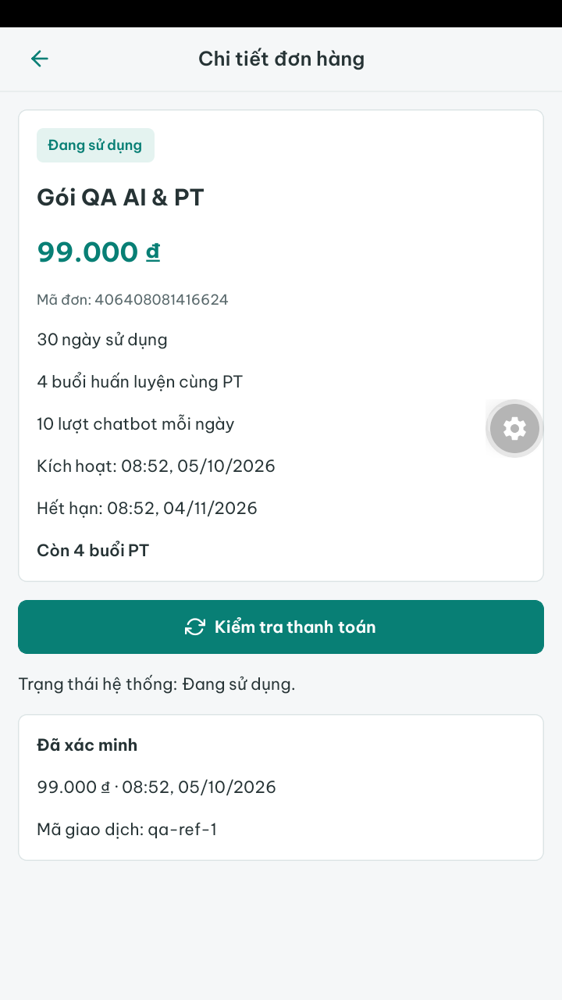
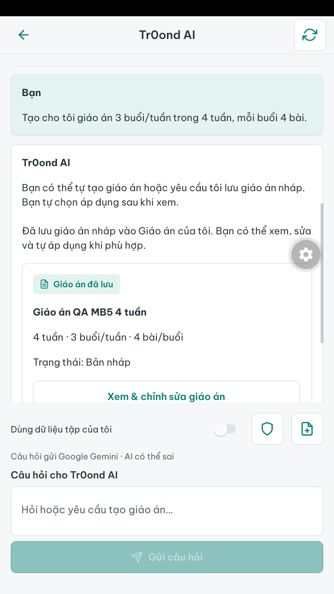
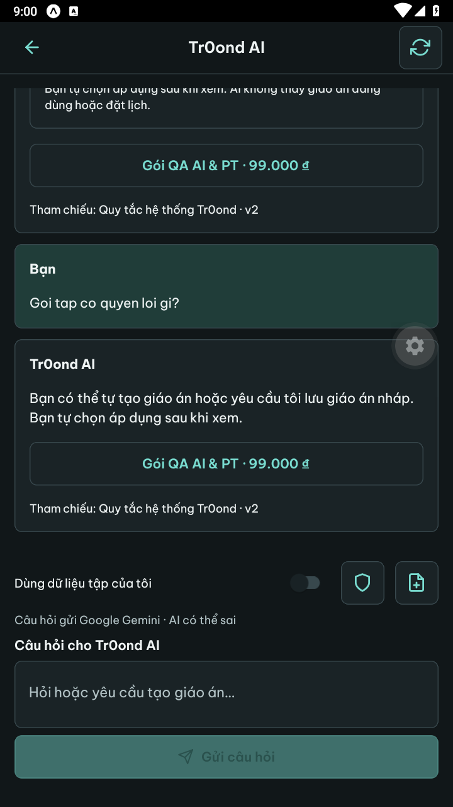

# MB5 — Đăng ký, gói/thanh toán và chatbot native

Ngày: **05/10/2026**. Tiếp nối MB4 theo yêu cầu “vậy làm tiếp đi”. Đã tích hợp và kiểm tra các luồng dưới đây trên Android giả lập; **payOS, Gemini và email trong QA được giả lập**. Không suy ra thanh toán thật, chất lượng AI thật hoặc nghiệm thu điện thoại thật từ kết quả này.

## Phạm vi và hành vi

| Use case / actor | Dữ liệu, endpoint và quyền | Trạng thái / failure / chống trùng |
| --- | --- | --- |
| Khách tạo tài khoản KH | `POST /api/v1/mobile/dang-ky`: họ tên, email, mật khẩu/xác nhận; FormRequest chặn trường lạ/vai trò | Transaction service hiện có tạo tài khoản/hồ sơ KH; 201 `data: null`, không cấp token. Email trùng/mật khẩu sai trả 422, giới hạn 72 byte bcrypt và throttle hiện có |
| Khách/KH/PT khôi phục | `POST /mobile/quen-mat-khau` và `/mobile/dat-lai-mat-khau` dưới `/api/v1`; email và broker hiện có | Quên mật khẩu trả thông báo giống nhau cho email có/không tồn tại; mã một lần/60 phút, xác nhận mật khẩu bắt buộc. Reset thu hồi mọi phiên cũ, không tự đăng nhập; mã sai/dùng lại trả lỗi |
| Khách/KH/PT đọc gói/FAQ | `GET /goi-tap`, `/goi-tap/{id}`, `/faq` | Nội dung công khai thực, phân trang; không thêm social login, số điện thoại hay quyền lợi giả từ bản thiết kế |
| KH mua/xem đơn | API `/khach-hang/goi-cua-toi`, `/don-hang`, `/don-hang/{id}` | Backend sở hữu snapshot giá/quyền và khóa/transaction. Khác KH không đọc được đơn. Stable UUID khi tạo/thử lại, payload đang chờ không được đổi; gói đang dùng/đơn chờ xử lý theo 409 hiện có |
| KH thanh toán | POST `/don-hang/{id}/link-thanh-toan` và `/dong-bo` | Chỉ mở HTTPS đúng host `pay.payos.vn`. Foreground GET chi tiết; nút kiểm tra mới đồng bộ payOS qua BE. Không cấp gói từ URL/countdown. Khoản thu/kích hoạt trong transaction BE, không cấp lặp khi kiểm tra lại |
| KH hỏi AI | API `/khach-hang/chatbot/hoi-thoai` và `/{id}/tin-nhan` | Hạn mức/gói/quyền từ BE; consent cá nhân mặc định tắt. Timeout 90 giây, retry thủ công đọc lịch sử UUID trước, giữ nguyên nội dung/consent. Provider lỗi không tính lượt thành công; PT không được thêm quyền AI |
| KH nhận nháp AI | Giáo án lưu bằng service chatbot hiện có; mở màn MB3 theo ID từ BE | Chỉ `NHAP`, không tự áp dụng/tạo lịch. Hiển thị chữ/nguồn đã được BE xác thực; người dùng xem/sửa/xác nhận trong module giáo án |

401/403/404/409/422/429/5xx dùng HTTP client và xử lý phiên/thao tác chung. Các màn có tải/chưa có dữ liệu/lỗi/thử lại. Hàng đợi UUID, nội dung AI, mật khẩu và mã reset chỉ ở bộ nhớ; root logout/đổi tài khoản hủy request và bỏ state cũ.

## Thay đổi source

- [Auth native controller](../../BE/app/Http/Controllers/Api/PhienMobileController.php), [request đăng ký](../../BE/app/Http/Requests/DangKyMobileRequest.php), [request reset](../../BE/app/Http/Requests/KhoiPhucMatKhauRequest.php), [routes](../../BE/routes/api.php): ba endpoint native tái sử dụng đăng ký/password broker. Reset validation nhận đúng action `datLai` cho cả web/native. Nhóm auth `/mobile` bỏ middleware SPA stateful; web giữ session/CSRF.
- [Service mobile](../../Mobile/src/services/hoanThienService.js), [utils](../../Mobile/src/utils/hoanThien.js), [màn Auth](../../Mobile/src/screens/Auth/DangKy.js), [khôi phục](../../Mobile/src/screens/Auth/KhoiPhuc.js), [màn HoanThien](../../Mobile/src/screens/HoanThien/GoiTap.js): gói, đơn, chi tiết thanh toán, FAQ, danh sách/hội thoại AI. Navigation/lối tắt ở Tổng quan/Cá nhân và ánh xạ thông báo đơn KH được nối vào API thật.
- [GiaoDien](../../Mobile/src/components/GiaoDien.js) cho inputStyle riêng để composer AI gọn; [tapLuyen](../../Mobile/src/utils/tapLuyen.js) đưa `coCho` vào đúng hàng đợi UUID, bỏ thuộc tính tham chiếu biến không tồn tại khỏi payload giáo án.
- [Tests mobile](../../Mobile/tests/hoanThien.test.mjs), [auth BE](../../BE/tests/Feature/PhienMobileTest.php), [mua gói](../../BE/tests/Feature/MuaGoiTest.php), [chatbot](../../BE/tests/Feature/ChatbotTest.php) bổ sung validation, bearer, ownership, replay, quota và thu hồi.
- Tài liệu mobile/README/contract/DECISIONS cập nhật trạng thái MB5. Không thêm dependency hoặc migration ở MB5; không đổi cấu hình return URL/email web, không sửa dữ liệu chính.

Form reset nhận mã 64 hex hoặc liên kết email HTTP(S) có path `/dat-lai-mat-khau` và token ở fragment; không đọc query/scheme lạ hoặc tự xử lý deep link. Người dùng nhập email thủ công, mã và mật khẩu được che. Việc gửi email thật tiếp tục dùng cấu hình Backend hiện có, chưa nghiệm thu trong MB5.

## Kiểm thử đã thực sự chạy

Môi trường: Windows, Node 22.20.0; Expo SDK **57.0.26**, React Native **0.86.3**, React **19.2.3**; PHP **8.4**, Laravel **13**, MariaDB **10.4.32**. Native: LDPlayer 9, Android 9/API 28, Expo Go SDK 57. Database QA tách riêng và có kiểm tra tên trước khi tạo/xóa; không dùng SQLite thay cho database giao dịch.

| Kiểm tra | Kết quả |
| --- | --- |
| `rtk proxy npm test` trong Mobile | **39/39 PASS**; URL thanh toán/reset, mật khẩu Unicode/byte, UUID, giới hạn prompt giáo án, nguồn tin/thông báo, auth/chat/tập luyện |
| `rtk proxy php artisan test --filter="PhienMobileTest\|MuaGoiTest\|ChatbotTest\|HoSoTaiKhoanTest\|XacThucTest"` trong BE | **89 PASS, 1.048 assertions** trên MariaDB; gồm hồi quy auth web, native signup/reset, token nhiều thiết bị/thu hồi, bearer gói/AI và replay/ownership |
| `rtk proxy npx expo-doctor` | **21/21 PASS** |
| `rtk proxy npx expo export --platform all --output-dir .expo/mb5-export` | **Android/iOS/web PASS** sau thay đổi UI cuối; đây là bundle/assets, chưa phải APK/IPA |
| Prettier `--check --single-quote --no-semi` cho source MB5 và các file mobile liên quan | PASS |
| `rtk proxy php vendor/bin/pint --test --dirty` | PASS |
| `rtk proxy git diff --check` và kiểm tra link/UTF-8 tài liệu | PASS; Git có nhắc chuẩn hóa LF/CRLF của máy Windows |

### Hành trình native

1. Tạo KH mới, chưa có token; quên mật khẩu bằng Notification fake, nhập mã nhận từ fixture, reset thành công và đăng nhập bằng mật khẩu mới.
2. KH chưa có gói xem catalog; bấm tạo đơn liên tiếp chỉ một đơn. Mở link giả lập bằng Chrome rồi trở lại app: đơn vẫn chờ, chưa tự kích hoạt. Kiểm tra khi payOS fake chưa trả tiền vẫn chờ; sau dữ liệu PAID có chữ ký hợp lệ mới kích hoạt. Kiểm tra lại vẫn một khoản thu/quyền lợi. Gói QA giá 99.000 đồng, 30 ngày, 4 buổi PT và 10 lượt AI/ngày; đây là fixture, không phải giá bán chính thức.
3. AI provider fake lỗi: một yêu cầu, chưa tính lượt thành công. Thử lại cùng UUID sau khi provider hồi phục: một câu trả lời, quota giảm một. Tạo giáo án 3 buổi/tuần × 4 tuần × 4 bài: **một NHAP 12 buổi/48 bài**, mở trong màn giáo án; **không có giáo án tự áp dụng**.
4. Router QA trả **503 sau khi nghiệp vụ đã commit** cho câu AI và đơn. App thử lại: đọc được câu đã thành công mà không gửi thêm lượt; đơn trả lại cùng ID/UUID. Đây là lỗi phản hồi có chủ đích, không phải mô phỏng mất TCP thực tế.
5. Logout KH mới rồi login KH khác: AI quota/lịch sử theo tài khoản mới, không lộ hội thoại cũ. Đơn thử lại của KH thứ hai không tăng số đơn.
6. Kiểm tra FAQ đã xuất bản, sáng/tối, composer ở chiều rộng 375 dp/chữ 1,3; trả density/font_scale/giao diện sáng về cấu hình ban đầu. Nhãn tab cũ có hiện tượng cắt khi chữ lớn, cần rà ở MB6. LDPlayer không hiện bàn phím phần mềm trong lần QA này, chưa ghi nhận ca bàn phím/TalkBack đạt.

Số đếm QA trước dọn: 3 tài khoản, 2 đơn, 1 khoản thu, 3 yêu cầu AI thành công, 1 nháp/48 bài, **0 giáo án áp dụng và 0 token** sau logout. Database QA, state chứa mã reset và router/helper PHP đã xóa. `.env.local` khôi phục từ bản sao chính xác; bỏ adb reverse 8002, khởi động lại Metro với API/Reverb ban đầu. API đã khôi phục trả health **200**; server Wi-Fi mở lại bên cạnh server localhost.

## Ảnh QA

Ảnh chỉ chứa dữ liệu giả lập, không có token/mật khẩu người thật.

## Cách xem và giới hạn còn lại

Metro đang phục vụ app ở cổng 8081, LDPlayer mở Expo Go. Từ Đăng nhập xem gói/FAQ hoặc đăng nhập tài khoản local hiện có theo [Mobile README](../mobile/README.md); không còn tài khoản/database QA MB5. KH vào Cá nhân để mở đơn/AI. Chỉ kiểm tra nhà cung cấp thật khi môi trường/tài khoản/hạn mức đã phù hợp; không dùng lại link checkout giả trong ảnh.

MB6 còn điện thoại Android thật, bàn phím phần mềm, TalkBack, font lớn ở tab, mạng yếu/mất TCP, hiệu năng và bản cài ký nội bộ. Chưa tạo APK/IPA, chưa publish store/push; thông tin nhận diện/owner/kênh phân phối vẫn theo [quyết định phát hành](../mobile/MOI_TRUONG_PHAT_HANH.md). Chưa nghiệm thu email thật, giao dịch/webhook payOS thật hoặc chất lượng Gemini thật qua app. Cảnh báo dependency từ bootstrap còn theo dõi ở MB6, không nâng/hạ SDK bằng `audit fix --force` trong bước này.
