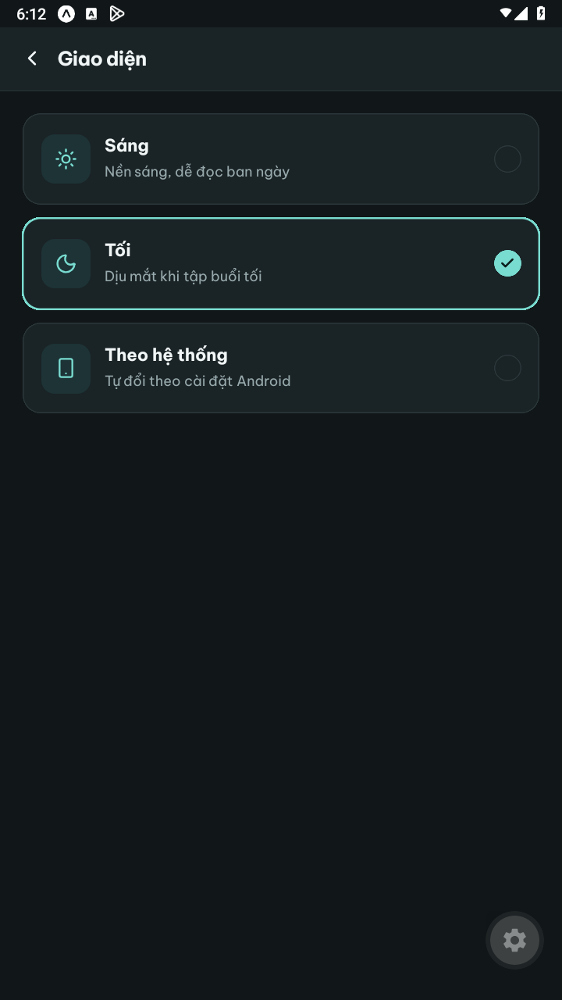
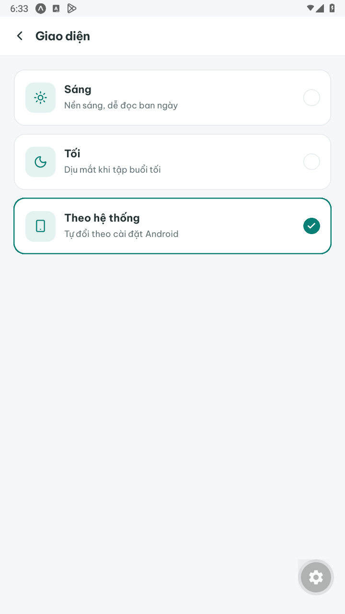
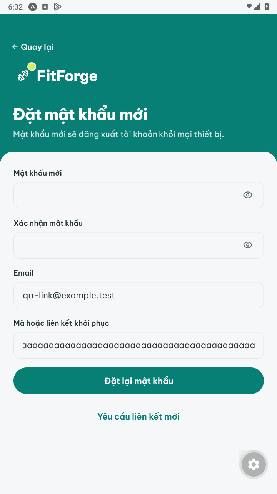
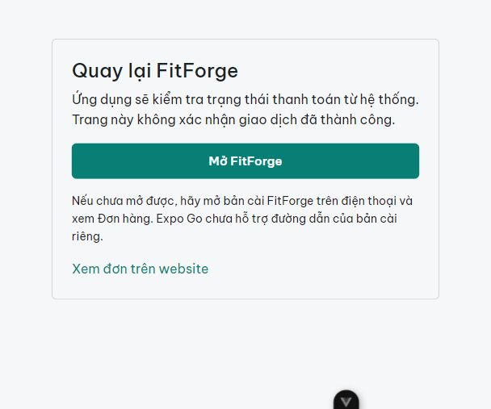
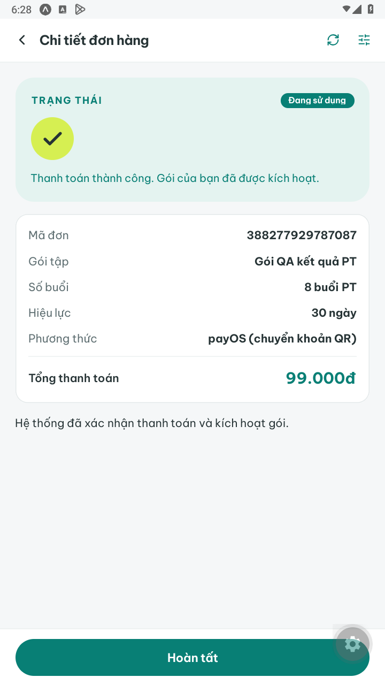
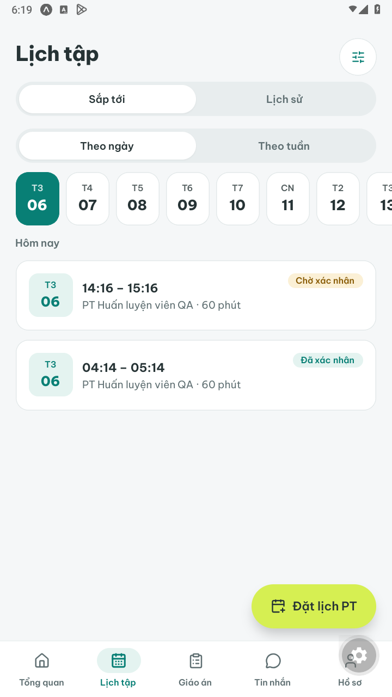
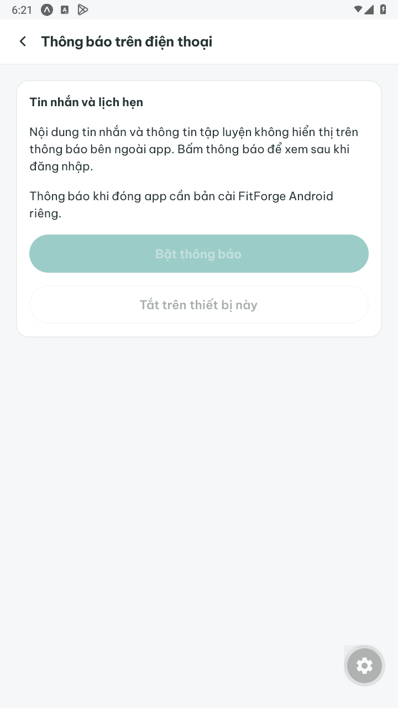

# Tiện ích mobile C44 — kiểm chứng ngày 06/10/2026

Đã triển khai lưu giao diện, deep link, lịch realtime và nền tảng push theo yêu cầu chủ dự án. Giữ logic xác thực, quyền tài nguyên, đặt lịch/trừ lượt và xác minh thanh toán. **Push thật khi app đóng chưa được nghiệm thu:** chưa có EAS project ID/FCM và bản cài Android riêng. Không có push thật, thanh toán thật, cloud build hoặc publish trong lần này.

## Thay đổi

| Module/file chính | Hành vi |
| --- | --- |
| `Mobile/src/services/tuyChonGiaoDien.js`, `khoGiaoDien.js`, `contexts/XemTruocContext.js` | Lưu sáng/tối/hệ thống theo thiết bị; đọc trước khi mở app; chọn nhanh giữ giá trị cuối; logout không xóa sở thích |
| `Mobile/src/utils/lienKet.js`, `navigation/DieuHuong.js`, `screens/Auth/KhoiPhuc.js` | Mở link cold/warm, điền email/mã reset, giữ đích riêng đến khi đăng nhập; whitelist màn hình/ID/vai trò và xóa params chứa mã |
| `BE/app/Notifications/KhoiPhucMatKhau.php`, `KhoiPhucMatKhauService.php`, `PhienMobileController.php` | Email yêu cầu từ mobile có link FitForge và web dự phòng; thời hạn/một lần sử dụng vẫn do BE |
| `BE/app/Services/PayosService.php`, `MuaGoiService.php`, `DonHangController.php`; `FE/src/views/MoUngDung/index.vue`, router; `Mobile/src/screens/HoanThien/ChiTietDon.js` | Link payOS mới từ mobile quay về cầu nối công khai rồi mở đúng đơn; trở về app tự kiểm tra trạng thái; chờ khóa thao tác mở trình duyệt kết thúc trước khi đồng bộ |
| `BE/app/Events/LichCanDongBo.php`, `Services/LichRealtimeService.php`, `ThongBaoService.php`, `PhanCongService.php`, `LichHenService.php`, provider | Tín hiệu lịch private sau commit; cập nhật khung giờ, lịch hẹn, đóng xử lý, phân công và lịch tự tập; rollback không phát |
| `Mobile/src/services/kenhChat.js`, `contexts/TraoDoiContext.js`, màn lịch/đặt lịch/chi tiết/khung giờ/tổng quan/lịch tự tập | Gộp tín hiệu 200ms, tải HTTP lại theo quyền; giữ fallback foreground/reconnect/45 giây và dữ liệu form đang sửa |
| `BE/app/Http/Controllers/Api/ThongBaoDayController.php`, request, `Services/ThongBaoDayService.php`, `config/push.php`, routes API/console | Đăng ký push theo bearer thiết bị; hàng đợi cùng transaction, retry/ticket/receipt, kiểm tra phiên/quyền trước gửi; tắt riêng thiết bị |
| Migration `2026_10_06_000045_create_thong_bao_day_tables.php` | Thêm `thiet_bi_push`, `hang_doi_push`; đã migrate local, giữ dữ liệu nghiệp vụ hiện có |
| `Mobile/src/contexts/ThongBaoDayContext.js`, `services/thongBaoDayService.js`, `screens/CaNhan/ThongBaoDay.js`, `HoSo.js`, `App.js` | Bật/tắt thủ công, quyền hệ điều hành, refresh token, xử lý nhấn push; chặn Expo Go và tài khoản cũ |
| `Mobile/app.json`, `app.config.js`, `eas.json`, dependencies và tài liệu môi trường | Scheme `fitforge`, package `vn.fitforge.app`, SDK 57 notifications/linking/system-ui, profile APK nội bộ; chưa build APK |

## Kiểm tra đã chạy

Windows, Node, Expo SDK 57 / React Native 0.86.3; Laravel 13 và MariaDB 10.4.32. Test BE dùng database QA ngẫu nhiên, không migrate:fresh database ứng dụng. HTTP provider được giả lập, chặn request ngoài ý muốn.

| Kiểm tra | Kết quả |
| --- | --- |
| Mobile `npm test` | 56/56 PASS, gồm 5 test mới cho theme/link/push payload/socket lịch |
| FE `npm test` | 272/272 PASS |
| FE `npm run build` | PASS, trang cầu nối build được |
| BE `ChatTest`, `LichHenTest`, `MuaGoiTest`, `ThongBaoTest` | 60/60 PASS |
| BE `PhienMobileTest`, `KetQuaBuoiPtTest`, `NhatKyTapTest` | 31/31 PASS |
| BE `TienIchMobileTest` mới | 8/8 PASS: bearer/đa thiết bị/logout, retry/rollback, ticket/receipt, đổi tài khoản/phiên cũ, khóa/hết hạn/đổi mật khẩu/phân công, 429/DNR, realtime và URL payOS |
| Chạy lại sau chỉnh cuối: `TienIchMobileTest` + `LichHenTest` | 24/24 PASS, 265 assertions |
| Chạy lại `TienIchMobileTest` + `NhatKyTapTest` sau observer tự tập | 22/22 PASS, 315 assertions |
| Chạy lại `PhienMobileTest`, thêm kiểm tra link email mobile/web | 9/9 PASS, 169 assertions |
| Pint các file PHP thay đổi trong C44; Prettier các file JS/Vue thay đổi | PASS |
| Export Android Expo | PASS, 3.044 modules; đây là bundle kiểm tra, không phải APK hoặc push end-to-end |

Các nhóm BE có tổng **99 test khác nhau** đã đạt, chạy theo nhóm liên quan; những lần chạy lại ở cuối bảng không cộng thêm vào tổng này.

## Kiểm chứng trên LDPlayer

Android 9/API 28, Expo Go 57.0.2, viewport 720 × 1280. QA riêng có API 8017, Reverb 8092 và Metro 8087; tài khoản/dữ liệu giả, tách database ứng dụng. Không sửa kết quả tập, mật khẩu hoặc thanh toán tài khoản thật.

### Theme

Chọn tối, đóng tiến trình Expo Go rồi mở lại: nền tối vẫn được giữ; vào màn Giao diện xác nhận lựa chọn Tối. Chọn Theo hệ thống, đóng/mở lại: vẫn chọn Theo hệ thống. Sau QA trả tài khoản ban đầu về Sáng.

### Link reset

Link Expo Go mở đúng màn Đặt mật khẩu mới, điền email/mã từ fragment, cả lúc app đang chạy và sau khi đóng tiến trình. Dùng email `example.test` và chuỗi mã giả `a`; không gửi form, không thực hiện đổi mật khẩu thật. Test BE kiểm tra mã hợp lệ một lần, thu hồi nhiều phiên và URL email mobile/web.

### Thanh toán

Trang quay về mở không cần đăng nhập web, nút dẫn đúng `fitforge://don-hang/42`. Link Expo Go mở đúng đơn QA, trạng thái đã kích hoạt lấy từ BE. Không thực hiện thanh toán thật; request tạo link payOS mobile/web đã kiểm tra bằng HTTP fake và chữ ký QA.

### Lịch realtime

Giữ màn lịch KH mở, PT xác nhận lịch qua API bằng tài khoản QA khác. KH tự đổi **Chờ xác nhận → Đã xác nhận** sau tín hiệu Reverb, không kéo làm mới hoặc vào lại màn. Nhật ký Reverb ghi sự kiện `lich.cap-nhat` trên kênh private của KH. Kiểm thử BE xác nhận phát sau commit và không phát khi rollback.

### Push

Expo Go hiển thị giới hạn đúng, không gọi đăng ký remote push không được hỗ trợ. Ticket/receipt, nội dung generic, tắt thiết bị, thu hồi phiên, chống gửi hàng cũ và retry đã kiểm tra tại BE bằng provider giả lập. Chưa chứng minh được thông báo xuất hiện trên Android khi app đóng hoặc nhấn push cold/warm trong bản cài riêng.

## Phần còn cần môi trường bên ngoài

- EAS project ID công khai, Firebase Android cho package `vn.fitforge.app`, FCM v1 credential và bản cài riêng. Cấu hình theo [TIEN_ICH_THIET_BI.md](../mobile/TIEN_ICH_THIET_BI.md), sau đó bật `EXPO_PUSH_ENABLED`, chạy scheduler và nghiệm thu hai tài khoản QA trên Android có Play Services.
- Link scheme của bản cài cần build mới. Expo Go chỉ kiểm tra link `exp://.../--/...`; chưa nghiệm thu scheme qua ứng dụng email thật. Verified HTTPS App Links cần domain và chứng chỉ phát hành.
- Các link payOS đã tạo từ trước giữ return URL cũ; có thể quay app bằng tay để kiểm tra. Chưa nghiệm thu giao dịch payOS thật; trạng thái trên URL không bao giờ cấp gói.
- Push cần mạng/provider/scheduler. Android force-stop trong Settings có thể chặn nhận đến khi mở app lại; ticket/receipt không chứng minh người dùng đã thấy. Retry khi mất phản hồi provider có thể phát trùng.

Nguồn cấu hình: [Expo push setup](https://docs.expo.dev/push-notifications/push-notifications-setup/), [Expo receipts](https://docs.expo.dev/push-notifications/sending-notifications/), [Expo deep linking](https://docs.expo.dev/linking/into-your-app/).

## Xem kết quả

Ứng dụng chính: **Hồ sơ → Giao diện** hoặc **Thông báo trên điện thoại**; lịch cập nhật khi KH/PT thao tác nếu Reverb đang chạy. Không dùng skill thiết kế, không đổi bố cục đã chốt. Sau QA đã trả LDPlayer về Metro chính 8086/tài khoản ban đầu, trả trình duyệt về trang chủ 5173, dừng ba server QA và xóa database QA riêng. Các server chính vẫn giữ nguyên.
